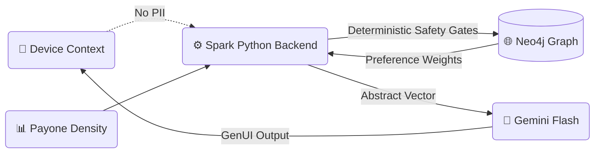

# ⚡ Spark — Generative City Wallet

> **"Right place. Right time. Right Spark."**

[](docs/ARCHITECTURE.md#privacy-boundary--on-device-layer)
[](docs/ARCHITECTURE.md#privacy-boundary--on-device-layer)

---

## 🔒 Privacy by Design (GDPR Statement)

Spark is built on a **Zero-PII Architecture**. We solve the "Personalization vs. Privacy" paradox by moving the intelligence to the edge:

1.  **On-Device Intent Extraction**: All raw sensor data (GPS, Motion, Health) is processed locally using **Gemma 3n**. Only abstract, anonymous "Intent Vectors" reach the Spark Cloud.
2.  **Geographic Quantization**: Precise coordinates never leave the device. Location is quantized into ~50m **H3 Grid Cells** before transmission.
3.  **Pseudonymous Continuity**: We use time-bounded, server-derived pseudonyms (`continuity_id`) instead of stable identifiers. Users can rotate or reset their identity at any time.
4.  **No Data Monetization**: Spark is designed for local commerce enablement, not data harvesting. We don't build "Social Graphs"—we build "Contextual Moments."

---

# ⚡ Spark — Overview

[](https://react.dev/)
[](https://react.dev/)
[](https://fastapi.tiangolo.com/)
[](https://ai.google.dev/)
[](https://ai.google.dev/edge)
[](https://neo4j.com/)
[](https://www.mapbox.com/)

Spark is an AI-powered city wallet that detects the most relevant local offer for a user in real time, generates it dynamically based on context, and makes it redeemable through a simulated checkout — all while keeping sensitive data on-device.

Built for the **DSV Gruppe Hackathon** — HackNation 2025.

> **🏅 Hackathon Judges:** Please jump directly to our [Hackathon Judge Guide](docs/HACKATHON_JUDGE_GUIDE.md) for a curated technical tour.
> 
> **Key Submission Evidence:**
> - **[Mia's Scenario Demo](scripts/demo/mia_scenario.py)**: A concrete demo script showing the system responding to "Rain + Low Density" exactly as requested in the brief.
> - **[UX Rationale](docs/UX-RATIONALE.md)**: Our strategy for "3-Second Instant Comprehension" using GenUI.
> - **[Merchant Portal Mockup](apps/web-dashboard/src/App.tsx)**: Showing how businesses set AI goals (e.g., "Fill Quiet Hours").
> - **Privacy Shield**: See our [GDPR Statement](#-privacy-by-design-gdpr-statement) above.

### How it Works (in 10 seconds)



---

## The Problem in One Sentence

Between a person walking past a quiet café and a perfectly timed, personally relevant offer — there is a gap. Spark closes it.

## What Makes Spark Different

- Not a coupon app. Offers don't exist until the moment they're needed.
- Not template-filling. The offer card (UI, imagery, tone, discount) is generated by AI from context signals.
- Not cloud-first. Movement, preferences, and location are processed on-device. Only an abstract intent vector reaches the server.
- Powered by Payone. Transaction density from local merchants is the core trigger signal — the unfair advantage that only DSV/Payone can provide.

---

## Three Modules

| Module | What it does |
|--------|-------------|
| **Context Sensing Layer** | Aggregates weather, location, movement, Payone density, local events into a composite context state |
| **Generative Offer Engine** | LLM generates the full offer: content, visual style, discount, timing — not from templates |
| **Seamless Checkout & Redemption** | Dynamic QR token, merchant confirmation, Spark cashback animation |

---

## Documentation

| Where | What |
|-------|------|
| **[`docs/README.md`](docs/README.md)** | **Current** docs index — implementation truth + Neo4j user graph |
| **[`docs/ARCHITECTURE.md`](docs/ARCHITECTURE.md)** | Architecture, hybrid pipeline, FastAPI routers, SQLite vs Neo4j |
| **[`docs/DEVELOPMENT.md`](docs/DEVELOPMENT.md)** | npm workspaces, Turbo, folder map, root scripts, CI, Docker |
| **[`docs/architecture/neo4j-graph.md`](docs/architecture/neo4j-graph.md)** | Server-side knowledge graph: model, APIs, env vars, ops limits |
| **[`docs/INTEGRATION.md`](docs/INTEGRATION.md)** | Frontend ↔ FastAPI backend handshake point and wiring guide |
| **[`docs/planning/README.md`](docs/planning/README.md)** | Design, pitch, and hackathon planning (moved from repo-root `docs/`) |

---

## Demo / Submission Status (Main README Source)

This section replaces the remaining TODO intent from `docs/planning/12-SUBMISSION-README.md` directly in the main README.

References: [`docs/planning/12-SUBMISSION-README.md`](docs/planning/12-SUBMISSION-README.md), [`PLAN.md`](PLAN.md)

### What worked well (current state)

- Deterministic offer selection and rule gating are implemented with audit trace support.
- Neo4j graph integration adds explainability, idempotent write protection, preference decay, retention cleanup, and migration tracking.
- Privacy architecture is enforced by design boundary: on-device context abstraction and server-side pseudonymous session processing.
- Monorepo quality gates are in place (`lint`, `typecheck`, `test`, contract symbol checks) and documented in `docs/DEVELOPMENT.md`.

### What remains after MVP implementation

- Frontend Spark ↔ FastAPI wiring: the Lovable frontend and the FastAPI backend are not yet connected (see [`docs/INTEGRATION.md`](docs/INTEGRATION.md)).
- Demo/story polish remains: ensure README/demo script values and runbook outputs stay fully aligned for judging.

### Local run instructions (actual monorepo paths)

Run from repo root:

```bash
# API (FastAPI on :8000)
npm run dev:api

# Mobile (React PWA)
npm run dev:mobile

# Dashboard (Vite on :3000)
npm run dev:dashboard
```

Taskfile workflow (recommended):

```bash
# Show all tasks
task --list

# API
task dev:api

# Load Munich demo data (both venue + legacy payone pipelines)
task demo:load-munich

# Quality gates
task lint:api
task test:contracts
task test:api
```

Optional quality checks:

```bash
npm run lint
npm run typecheck
npm run test
```

### Docker run instructions (backend stack)

Run from repo root:

```bash
# 1) Build and start services in background
docker compose up -d --build

# 2) Follow backend logs (optional)
docker compose logs -f backend

# 3) Stop stack
docker compose down
```

Services exposed by `docker-compose.yml`:

- backend API: `http://localhost:8000`
- Neo4j Browser: `http://localhost:7474`
- Neo4j Bolt: `localhost:7687`
- Fluent Bit HTTP input: `localhost:8889` (container `8888`)
- Fluent Bit metrics/API: `http://localhost:2021` (container `2020`)

If `8889`/`2021` are already in use, override host ports at startup:

```bash
FLUENTBIT_HTTP_PORT=8890 FLUENTBIT_METRICS_PORT=2022 docker compose up -d --build
```

Reset everything including named volumes:

```bash
docker compose down -v
```

Graph behavior in Docker:

- full stack includes Neo4j by default (`spark-neo4j` service)
- backend waits for Neo4j health before startup
- backend graph client is wired to compose DNS (`bolt://neo4j:7687`)

### Localhost services and credentials

After `docker compose up -d --build`, use these local endpoints:

| Service | URL / Address | Default credentials |
|---|---|---|
| FastAPI base | `http://localhost:8000` | none |
| Swagger UI | `http://localhost:8000/docs` | none |
| ReDoc | `http://localhost:8000/redoc` | none |
| OpenAPI JSON | `http://localhost:8000/openapi.json` | none |
| API health | `http://localhost:8000/api/v1/health` | none |
| Graph health | `http://localhost:8000/api/v1/graph/health` | none |
| Neo4j Browser | `http://localhost:7474` | user `neo4j`, password `spark-neo4j-dev` |
| Neo4j Bolt | `localhost:7687` | user `neo4j`, password `spark-neo4j-dev` |
| Fluent Bit HTTP input | `http://localhost:8889` | none |
| Fluent Bit metrics/API | `http://localhost:2021` | none |

### Submission data locked for demo

- **100 Munich Merchants**: Demo merchant list loaded from `resources/mock_venues_munich.json`.
- **42.0**: Community Hero Score baseline used in the submission narrative.
- **Milan, David, Finn, Lars**: Final team listed in submission materials.

### Readiness gates

- [x] Architecture/runtime docs aligned (`docs/ARCHITECTURE.md`, `docs/DEVELOPMENT.md`, graph runtime docs).
- [x] Planning-to-runtime gaps explicitly tracked (`PLAN.md`).
- [x] End-to-end demo loop re-validated on final demo build (offer -> accept -> QR -> redeem -> cashback).
- [x] Privacy/logging claims re-verified against final demo payloads.
- [x] Remaining submission data filled for Munich demo.

---

## Tech Stack (MVP)

- **Consumer + Merchant UI:** React / Vite / Supabase (`Frontend Spark/`) — full PWA with auth, offer display, QR redemption, merchant dashboard
- **Mobile (legacy):** React Native PWA (`apps/mobile/`) — on-device Gemma inference prototype
- **Backend:** FastAPI (Python 3.12+)
- **Edge AI:** **Gemma 3n** via Google AI Edge (On-device intent extraction — no PII leaves the boundary)
- **Cloud AI:** **Gemini Flash** (Just-in-time GenUI and offer framing — low latency, high reasoning)
- **Persistence:** SQLite (Audit & Idempotency) + **Neo4j** (Knowledge Graph for explainable personalization)
- **Ingestion:** **Fluent Bit** + Lua (High-performance Payone density bridge)
- **Context Ecosystem:** Google Places (New), OpenWeatherMap, Luma, Strava, VVS
- **Maps:** Mapbox (Real-time merchant heatmapping)

---

## Graph Ops (Neo4j)

The backend can persist a **pseudonymous session graph** (preferences, offers, outcomes) when Neo4j is enabled. Configure connection and tuning via `.env` (see `apps/api/src/spark/config.py` for `NEO4J_*`, `GRAPH_*`, retention, and decay variables).

**What you get:** machine-readable **explainability** on generated offers; event-granular **idempotent** learning writes on retries; per-category **learning guardrails** against burst noise; **preference decay** so old signals fade; source-aware **retention** for learning artifacts; **migrations** tracked in the graph for schema evolution.

With the API running on `http://localhost:8000`:

```bash
# Health + driver metrics
curl -s http://localhost:8000/api/v1/graph/health | jq .

# Node/edge counts
curl -s http://localhost:8000/api/v1/graph/stats | jq .

# Applied migrations (GraphMigration nodes)
curl -s http://localhost:8000/api/v1/graph/migrations | jq .

# Preferences with event-level attribution (optional explainability detail)
curl -s 'http://localhost:8000/api/v1/graph/sessions/sess-123/preferences?include_attribution=true&event_limit=10' | jq .

# Delete old offers/contexts/redemptions/wallet events + stale sessions + old PREFERS/AVOIDS edges
curl -s -X POST 'http://localhost:8000/api/v1/graph/cleanup?retention_days=30' | jq .

# Linear decay on stale PREFERS edges (after N days without reinforcement)
curl -s -X POST 'http://localhost:8000/api/v1/graph/decay-preferences?stale_after_days=7&default_decay_rate=0.01' | jq .
```

**Scheduled maintenance (cron)** — from the repo root; uses the same `.env` as the app:

```cron
0 3 * * * cd /path/to/Generative-City-Wallet && /usr/local/bin/uv run python infra/pipeline/graph-maintenance.py >> /var/log/spark-graph-maintenance.log 2>&1
```

Adjust `cd` and `uv` path to your machine. The script runs **cleanup** (artifact + preference-edge retention) then **decay** in one shot, and emits maintenance health metadata (`last_decay_age_hours`, `decay_gap_alarm`) for monitoring.

---

## Name & Branding

**Spark** — a direct nod to *Sparkasse* (German Savings Banks). Suggests igniting the local economy. The "Spark cashback" animation (credit flying into wallet balance) closes the loop visually.

Tagline: **"Make every minute local."**
