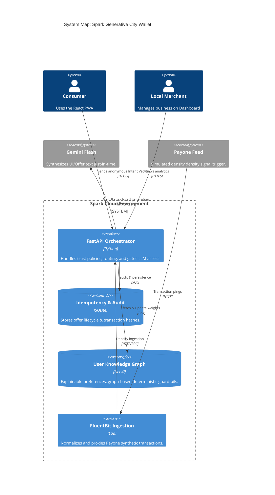
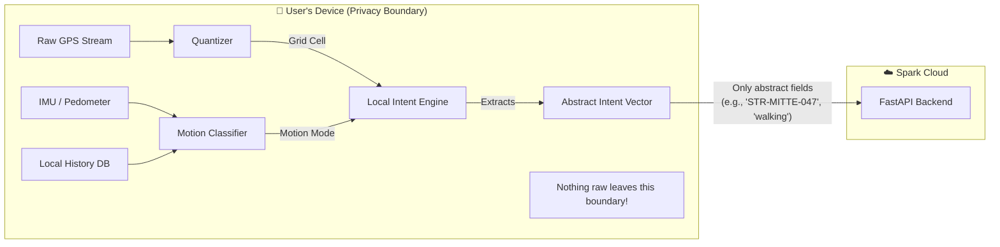
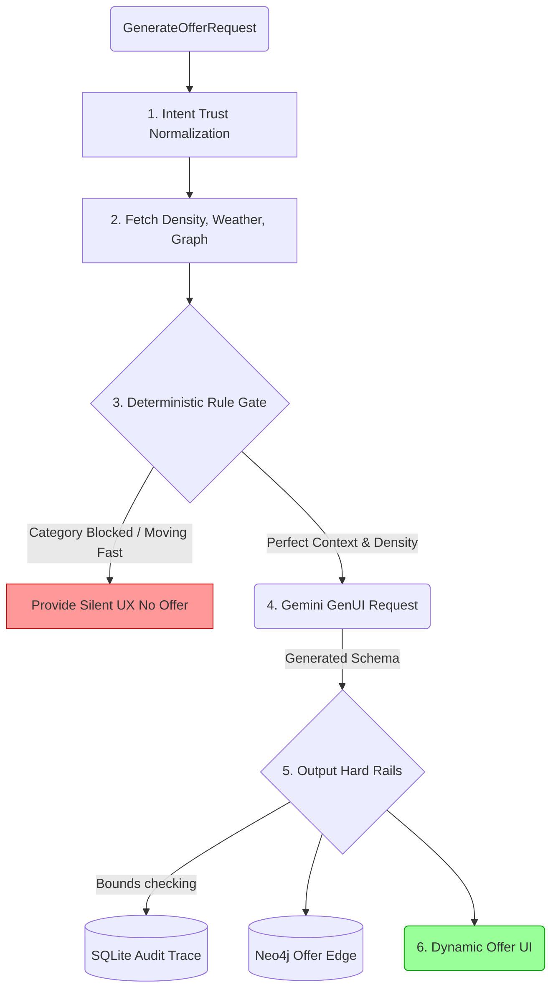

# Spark Architecture Overview

This is the primary architecture entrypoint.

For setup and workflows, see `DEVELOPMENT.md`.  
For planning rationale, see `planning/README.md`.

---

## System Map



---

## Privacy Boundary & On-Device Layer

Protect user PII by ensuring raw data never leaves the device.



### Components

**1. GPS Quantizer**
- Raw GPS coordinates never leave the device.
- Quantized to a ~50m grid cell (e.g., `"STR-MITTE-047"`).
- Only the grid cell reaches the server.

**2. IMU / Motion Classifier**
- Uses phone accelerometer + gyroscope.
- Classifies movement into: `commuting` | `browsing` | `stationary`.
- If commuting: no offer triggered (respecting user's attention).
- Dwell time: stationary near a merchant > 45s = "decision moment".

**3. Local Intent Engine**
- Lightweight model (Phi-3 / transformers.js or heuristic).
- Inputs: movement, time, history, battery.
- Outputs: **Intent Vector** (anonymous intent profile).

**4. Local Preference Store**
- SQLite / AsyncStorage on device.
- Stores: past interactions and inferred preferences.
- Never synced to cloud.

**5. Privacy Ledger (visible to user)**
- Visual log of what is being processed locally.
- Shows the "Cloud Exit Gate" content.

---

## Intent Vector Schema

What leaves the device. No PII. No raw location.

```json
{
  "grid_cell": "STR-MITTE-047",
  "movement_mode": "browsing",
  "time_bucket": "tuesday_lunch",
  "weather_need": "warmth_seeking",
  "social_preference": "quiet",
  "price_tier": "mid",
  "recent_categories": ["coffee", "bakery"],
  "dwell_signal": false,
  "battery_low": false,
  "session_id": "anon-uuid-no-linkage"
}
```

---

## Offer pipeline



Key rule: recommendation is deterministic; LLM is framing/UI generation only.

---

## Server-side self-learning loop (graph personalization)

Runtime now includes an explicit online learning loop for category preferences:

1. signal ingest (`redemption`, `offer outcome`, `wallet seed`)
2. event-granular idempotency (`graph_event_log` with `source_event_id` + payload hash)
3. update guardrails (per-session/per-category rate caps)
4. preference reinforcement (`PREFERS` bounded to `[0,1]`)
5. attribution logging (`preference_update_log`)
6. learning metrics (`learning_metrics_log`) and maintenance health checks

This loop keeps personalization adaptive while preserving deterministic gating and fail-soft behavior when graph dependencies are unavailable.

### Learning safety controls

- **Idempotency:** duplicate replay suppression is keyed on event identity, not only offer/session.
- **Rate limits:** noisy burst updates are suppressed with explicit outcome metadata.
- **Outcome visibility:** update paths record `applied`, `duplicate`, or `suppressed_by_guardrail`.
- **Drift telemetry:** weight volatility and suppression ratios are logged for monitoring.

### Explainability surface

- `GET /api/graph/sessions/{session_id}/preferences` returns preference weights/provenance.
- `GET /api/graph/sessions/{session_id}/preferences?include_attribution=true` also returns recent event-level attribution rows (`before_weight`, `delta`, `after_weight`, `source_type`, `event_key`, `outcome`, timestamp).

---

## Runtime ownership and mapping boundaries

- **Fluent Bit / Lua** owns ingress validation and lightweight event normalization.
  - required field checks
  - coercion and dead-letter routing
  - deterministic event enrichment such as time buckets and category aliases
  - forwards validated payone events to backend ingest (`POST /api/payone/ingest`)
- **Python runtime** owns domain canonicalization.
  - DB-authoritative overrides
  - typed contract assembly
  - intent trust policy normalization (`authoritative` / `advisory` field handling)
  - offer hard rails
  - audit and explainability metadata
  - OCR transit confidence policy (low-confidence OCR does not hard-gate offers)

Rule of thumb: if logic needs DB truth, response contracts, or product/business rules, it belongs in Python, not Lua.

---

## Intent trust policy (server-side)

For `POST /api/offers/generate`, the backend applies a field-level trust policy before deterministic scoring:

- `time_bucket` is **authoritative** server-side and recomputed from request time.
- `weather_need` is **advisory** and is validated against server weather context.
- `activity_signal` and `activity_confidence` are **advisory** and normalized with source/signal consistency:
  - `activity_source=none` forces `activity_signal=none` and `activity_confidence=0`
  - source-specific confidence caps are enforced (`movement_inferred` lower cap than health-linked sources)
- provenance is emitted in decision trace metadata under `intent_trust_normalization`.

Audit intent: every accepted/overridden value is recorded with source + reason so offer eligibility can be explained and replayed.

---

## Identity continuity policy

Runtime now derives a privacy-preserving continuity pseudonym for cross-session linkage without exposing stable raw identifiers:

- `continuity_id` is server-derived via HMAC from `intent.continuity_hint` when present.
- fallback behavior derives continuity from `session_id` when no hint is provided.
- continuity metadata includes `source` and `continuity_expires_at` (retention-bound window).
- provenance records include `continuity_id` as a `derived` field for auditability.
- reset/opt-out control is exposed via `POST /api/identity/continuity/reset`:
  - `opt_out=false` rotates to a new continuity hint/id pair
  - `opt_out=true` disables cross-session continuity hinting and returns null continuity id

Design intent: continuity remains opt-in and bounded while keeping deterministic explainability in the same trace surface used for other intent-field trust decisions.

---

## OCR Transit Flow (Raw Text -> Gating Input)

Runtime OCR path is now explicitly two-stage:

1. `POST /api/ocr/transit/parse`
   - accepts raw OCR text
   - runs parser adapter policy (`timeout + retries`)
   - returns typed `OCRTransitPayload` candidate (`OCRTransitParseResponse.payload`)
2. `POST /api/ocr/transit`
   - validates typed payload
   - applies confidence acceptance policy + malformed timestamp handling
   - returns gating-ready payload metadata
3. `POST /api/offers/generate`
   - consumes `ocr_transit` on `GenerateOfferRequest`
   - applies deterministic confidence threshold before hard-gating transit window logic

Design intent: parsing reliability concerns live in the OCR adapter layer, while offer eligibility remains deterministic in the offer pipeline.

---

## Spark Wave Runtime Semantics

Spark Wave is now integrated into both abuse control and economics surfaces:

- **Join anti-abuse gating**
  - per-session and per-wave burst limits remain enforced.
  - denied join attempts are now logged as explicit audit events (`wave_join_denied`) with categorized reasons.
  - a deterministic session risk score is computed from recent join attempts/denials/successes.
  - high-risk sessions are blocked from new joins (`wave_not_joinable`) until risk pressure decays over time windows.
- **Economics propagation**
  - wave catalyst bonus continues to apply at redemption (`confirm_redemption` cashback uplift).
  - offer pipeline now also applies session-scoped catalyst uplift when the session participates in an active/completed non-expired wave for the same merchant.
  - explainability includes `spark_wave_catalyst_bonus` with `catalyst_bonus_pct` metadata so uplift remains auditable.

Design intent: Spark Wave remains anonymous and deterministic while providing measurable social lift without bypassing baseline offer safety and rule gates.

---

## Code structure boundaries

- **`spark.models`** defines typed shapes grouped by lifecycle and boundary.
  - `api`: HTTP request/response DTOs
  - `context`: composite context and deterministic decision-trace models
  - `offers`: raw LLM output, canonical offer objects, rails audit
  - `transactions` / `redemption` / `conflict` / `agents`: subsystem-specific DTOs
  - `contracts.py` remains a compatibility barrel; new code should prefer narrow module imports
- **`spark.services`** owns business logic and canonicalization.
  - deterministic decision policy
  - composite context assembly
  - hard rails
  - redemption and transaction logic
- **`spark.repositories`** owns SQL-backed persistence operations.
  - inserts, upserts, and repository-style reads
  - canonical SQL access points for venues and transactions
- **`spark.graph`** owns Neo4j projection and personalization access.
  - `client`: driver lifecycle and fail-soft execution
  - `models`: graph-specific DTOs
  - `repositories`: graph read/write concerns split by domain
  - `repository.py`: compatibility facade over the graph sub-repositories
  - `schema` / `migrations` / `seed`: bootstrap and operational setup
- **`spark.db`** stays narrow.
  - connection/bootstrap helpers
  - schema
  - low-level package scaffolding
- **`spark.agents`** is an orchestration/adaptation layer.
  - prompt + model invocation
  - tool adapters for Strands
  - typed agent DTOs adapted back into canonical offer models

Rule of thumb: transport shapes live in `models`, policy lives in `services`, SQL lives in `repositories`, and `db` should not accumulate business logic.

---

## Local vs cloud data boundary

### On-device only (must not be uploaded raw)

- precise GPS traces and full location history
- raw sensor streams (motion/audio/camera)
- full personal interaction history and private app telemetry
- raw banking transaction history used for local preference bootstrapping

### Sent to backend (abstracted contract only)

- `IntentVector` fields from `GenerateOfferRequest`
- quantized location (`grid_cell`) instead of raw coordinates
- derived context flags (`movement_mode`, `weather_need`, `social_preference`, `price_tier`)
- abstracted activity hints (`activity_signal`, `activity_source`, `activity_confidence`) from optional Strava/native-health paths
- session-scoped identifiers needed for offer lifecycle and idempotency

### Backend-side data sources

- merchant and transaction-density signals (Payone/synthetic feed)
- weather context (OpenWeatherMap with fail-soft defaults + cache metadata)
- nearby place context (Google Places, fail-soft/cache-backed)
- local event context (Luma API, fail-soft/cache-backed)
- offer lifecycle, audit trail, wallet credits in SQLite
- optional graph projection in Neo4j (best-effort, fail-soft)
- optional LLM framing generation (no authority over entitlement values)

### Prohibited payload content

- raw coordinates, full route traces, or home/work inference fields
- direct personal identifiers beyond runtime-safe session keys
- uncapped LLM-authored business-critical values (discount/expiry/merchant identity)

### Enforcement points

1. request contract gate: `GenerateOfferRequest` / `IntentVector`
2. deterministic decision + graph rule gate before any LLM call
3. server-side hard rails overwrite and bound critical fields
4. audit persistence in `offer_audit_log` with trace metadata

---

## Documentation map

- `architecture/context-signals.md` — signal model and composite context usage
- `architecture/offer-decision-engine.md` — rules-first ranking and thresholding
- `architecture/llm-and-hard-rails.md` — generation boundary and safety enforcement
- `architecture/ingress-and-canonicalization.md` — runtime mapping boundary between Fluent Bit and Python
- `architecture/neo4j-graph.md` — graph model, rules, writes, operations
- `architecture/self-learning-api-reference.md` — online learning endpoints, attribution, idempotency, and ops controls
- `architecture/ARCHITECTURE-GUARDRAILS.md` — enforced layer boundaries and ownership rules
- `architecture/CODE-MAP.md` — where to place new feature code quickly
- `architecture/adr/clean-architecture-ddd-direction.md` — rationale for clean + DDD-inspired direction
- `DATA-MODEL.md` — canonical contracts + SQLite + graph projection model
- `architecture/consumer-app-surfaces.md` — delivery surfaces and app flow
- `architecture/merchant-dashboard.md` — business-facing workflow and coupling
- `architecture/data-simulation.md` — synthetic transaction and density layer

---

## Debug-first checklist

When behavior is unexpected, check in this order:

1. `POST /api/context/composite` output (context + decision trace)
2. `POST /api/offers/generate` rejection metadata (`decision_trace`, `graph_decision`)
3. Rails output in `offer_audit_log.rails_audit`
4. Graph health and session preference state (`/api/graph/health`, `/api/graph/sessions/{id}/preferences`)
5. Movement rollout traces in decision metadata (`movement_hard_block`, `movement_category_adjustment`, movement-aware `recheck_in_minutes`)
6. OCR transit ingest payload (`POST /api/ocr/transit`) and `ocr_transit_input` explainability metadata
7. Spark Wave join semantics (`POST /api/waves/{id}/join`) including `join_applied`, denial reason patterns, and risk-gated rejections
8. Spark Wave bonus propagation in offer explainability (`spark_wave_catalyst_bonus`) and redemption bonus fields
