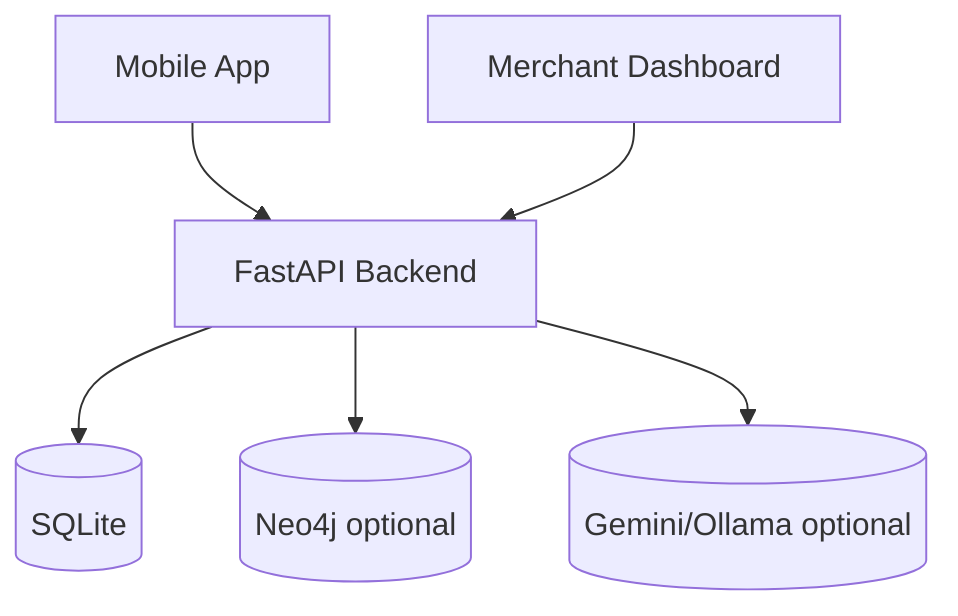

# Spark Architecture Overview

This is the primary architecture entrypoint.

For setup and workflows, see `DEVELOPMENT.md`.  
For planning rationale, see `planning/README.md`.

---

## System map



---

## Offer pipeline

```mermaid
flowchart TD
  req[GenerateOfferRequest] --> decision[DeterministicDecisionEngine]
  decision --> rules[GraphRuleGate]
  rules -->|reject| nooffer[No offer response]
  rules -->|accept| gen[LLM content generation]
  gen --> rails[HardRails]
  rails --> audit[SQLite audit]
  rails --> graph[Neo4j write best-effort]
  rails --> response[OfferObject]
```

Key rule: recommendation is deterministic; LLM is framing/UI generation only.

---

## Local vs cloud data boundary

### On-device only (must not be uploaded raw)

- precise GPS traces and full location history
- raw sensor streams (motion/audio/camera)
- full personal interaction history and private app telemetry
- raw banking transaction history used for local preference bootstrapping

### Sent to backend (abstracted contract only)

- `IntentVector` fields from `GenerateOfferRequest`
- quantized location (`grid_cell`) instead of raw coordinates
- derived context flags (`movement_mode`, `weather_need`, `social_preference`, `price_tier`)
- session-scoped identifiers needed for offer lifecycle and idempotency

### Backend-side data sources

- merchant and transaction-density signals (Payone/synthetic feed)
- offer lifecycle, audit trail, wallet credits in SQLite
- optional graph projection in Neo4j (best-effort, fail-soft)
- optional LLM framing generation (no authority over entitlement values)

### Prohibited payload content

- raw coordinates, full route traces, or home/work inference fields
- direct personal identifiers beyond runtime-safe session keys
- uncapped LLM-authored business-critical values (discount/expiry/merchant identity)

### Enforcement points

1. request contract gate: `GenerateOfferRequest` / `IntentVector`
2. deterministic decision + graph rule gate before any LLM call
3. server-side hard rails overwrite and bound critical fields
4. audit persistence in `offer_audit_log` with trace metadata

---

## Documentation map

- `architecture/context-signals.md` — signal model and composite context usage
- `architecture/offer-decision-engine.md` — rules-first ranking and thresholding
- `architecture/llm-and-hard-rails.md` — generation boundary and safety enforcement
- `architecture/neo4j-graph.md` — graph model, rules, writes, operations
- `DATA-MODEL.md` — canonical contracts + SQLite + graph projection model
- `architecture/consumer-app-surfaces.md` — delivery surfaces and app flow
- `architecture/merchant-dashboard.md` — business-facing workflow and coupling
- `architecture/data-simulation.md` — synthetic transaction and density layer

---

## Debug-first checklist

When behavior is unexpected, check in this order:

1. `POST /api/context/composite` output (context + decision trace)
2. `POST /api/offers/generate` rejection metadata (`decision_trace`, `graph_decision`)
3. Rails output in `offer_audit_log.rails_audit`
4. Graph health and session preference state (`/api/graph/health`, `/api/graph/sessions/{id}/preferences`)
