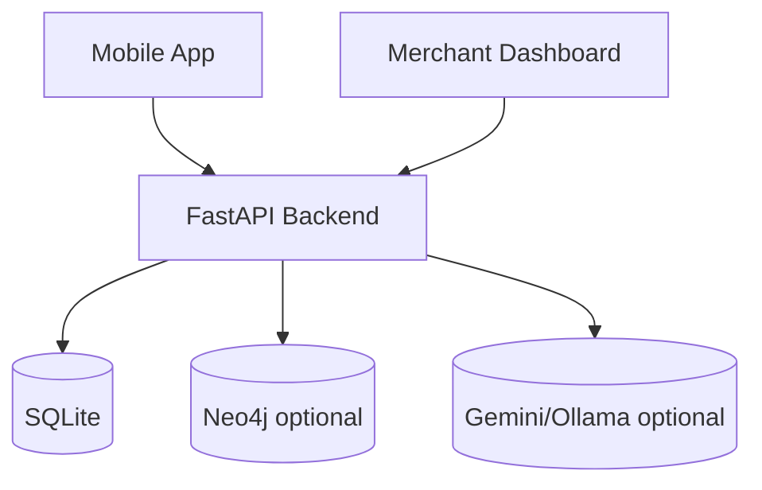

# Spark Architecture Overview

This is the primary architecture entrypoint.

For setup and workflows, see `DEVELOPMENT.md`.  
For planning rationale, see `planning/README.md`.

---

## System map



---

## Privacy Boundary & On-Device Layer

Protect user PII by ensuring raw data never leaves the device.

```
┌─────────────────────────────────────────────────────────────────┐
│                    USER'S DEVICE (On-Device)                     │
│                                                                   │
│  GPS (quantized)  ──┐                                            │
│  IMU / Pedometer  ──┤──► Local Intent Engine ──► Intent Vector   │
│  User History DB  ──┘   (Phi-3 / rule model)       │            │
│                                                     │            │
│  ← Nothing personal leaves this boundary ──────────┘            │
└─────────────────────────────────────────────────────────────────┘
                              │ Intent Vector (no PII)
                              ▼
┌─────────────────────────────────────────────────────────────────┐
│                    SPARK CLOUD BACKEND                           │
└─────────────────────────────────────────────────────────────────┘
```

### Components

**1. GPS Quantizer**
- Raw GPS coordinates never leave the device.
- Quantized to a ~50m grid cell (e.g., `"STR-MITTE-047"`).
- Only the grid cell reaches the server.

**2. IMU / Motion Classifier**
- Uses phone accelerometer + gyroscope.
- Classifies movement into: `commuting` | `browsing` | `stationary`.
- If commuting: no offer triggered (respecting user's attention).
- Dwell time: stationary near a merchant > 45s = "decision moment".

**3. Local Intent Engine**
- Lightweight model (Phi-3 / transformers.js or heuristic).
- Inputs: movement, time, history, battery.
- Outputs: **Intent Vector** (anonymous intent profile).

**4. Local Preference Store**
- SQLite / AsyncStorage on device.
- Stores: past interactions and inferred preferences.
- Never synced to cloud.

**5. Privacy Ledger (visible to user)**
- Visual log of what is being processed locally.
- Shows the "Cloud Exit Gate" content.

---

## Intent Vector Schema

What leaves the device. No PII. No raw location.

```json
{
  "grid_cell": "STR-MITTE-047",
  "movement_mode": "browsing",
  "time_bucket": "tuesday_lunch",
  "weather_need": "warmth_seeking",
  "social_preference": "quiet",
  "price_tier": "mid",
  "recent_categories": ["coffee", "bakery"],
  "dwell_signal": false,
  "battery_low": false,
  "session_id": "anon-uuid-no-linkage"
}
```

---

## Offer pipeline

```mermaid
flowchart TD
  req[GenerateOfferRequest] --> decision[DeterministicDecisionEngine]
  decision --> rules[GraphRuleGate]
  rules -->|reject| nooffer[No offer response]
  rules -->|accept| gen[LLM content generation]
  gen --> rails[HardRails]
  rails --> audit[SQLite audit]
  rails --> graph[Neo4j write best-effort]
  rails --> response[OfferObject]
```

Key rule: recommendation is deterministic; LLM is framing/UI generation only.

---

## Runtime ownership and mapping boundaries

- **Fluent Bit / Lua** owns ingress validation and lightweight event normalization.
  - required field checks
  - coercion and dead-letter routing
  - deterministic event enrichment such as time buckets and category aliases
  - forwards validated payone events to backend ingest (`POST /api/payone/ingest`)
- **Python runtime** owns domain canonicalization.
  - DB-authoritative overrides
  - typed contract assembly
  - offer hard rails
  - audit and explainability metadata
  - OCR transit confidence policy (low-confidence OCR does not hard-gate offers)

Rule of thumb: if logic needs DB truth, response contracts, or product/business rules, it belongs in Python, not Lua.

---

## OCR Transit Flow (Raw Text -> Gating Input)

Runtime OCR path is now explicitly two-stage:

1. `POST /api/ocr/transit/parse`
   - accepts raw OCR text
   - runs parser adapter policy (`timeout + retries`)
   - returns typed `OCRTransitPayload` candidate (`OCRTransitParseResponse.payload`)
2. `POST /api/ocr/transit`
   - validates typed payload
   - applies confidence acceptance policy + malformed timestamp handling
   - returns gating-ready payload metadata
3. `POST /api/offers/generate`
   - consumes `ocr_transit` on `GenerateOfferRequest`
   - applies deterministic confidence threshold before hard-gating transit window logic

Design intent: parsing reliability concerns live in the OCR adapter layer, while offer eligibility remains deterministic in the offer pipeline.

---

## Code structure boundaries

- **`spark.models`** defines typed shapes grouped by lifecycle and boundary.
  - `api`: HTTP request/response DTOs
  - `context`: composite context and deterministic decision-trace models
  - `offers`: raw LLM output, canonical offer objects, rails audit
  - `transactions` / `redemption` / `conflict` / `agents`: subsystem-specific DTOs
  - `contracts.py` remains a compatibility barrel; new code should prefer narrow module imports
- **`spark.services`** owns business logic and canonicalization.
  - deterministic decision policy
  - composite context assembly
  - hard rails
  - redemption and transaction logic
- **`spark.repositories`** owns SQL-backed persistence operations.
  - inserts, upserts, and repository-style reads
  - canonical SQL access points for venues and transactions
- **`spark.graph`** owns Neo4j projection and personalization access.
  - `client`: driver lifecycle and fail-soft execution
  - `models`: graph-specific DTOs
  - `repositories`: graph read/write concerns split by domain
  - `repository.py`: compatibility facade over the graph sub-repositories
  - `schema` / `migrations` / `seed`: bootstrap and operational setup
- **`spark.db`** stays narrow.
  - connection/bootstrap helpers
  - schema
  - low-level package scaffolding
- **`spark.agents`** is an orchestration/adaptation layer.
  - prompt + model invocation
  - tool adapters for Strands
  - typed agent DTOs adapted back into canonical offer models

Rule of thumb: transport shapes live in `models`, policy lives in `services`, SQL lives in `repositories`, and `db` should not accumulate business logic.

---

## Local vs cloud data boundary

### On-device only (must not be uploaded raw)

- precise GPS traces and full location history
- raw sensor streams (motion/audio/camera)
- full personal interaction history and private app telemetry
- raw banking transaction history used for local preference bootstrapping

### Sent to backend (abstracted contract only)

- `IntentVector` fields from `GenerateOfferRequest`
- quantized location (`grid_cell`) instead of raw coordinates
- derived context flags (`movement_mode`, `weather_need`, `social_preference`, `price_tier`)
- session-scoped identifiers needed for offer lifecycle and idempotency

### Backend-side data sources

- merchant and transaction-density signals (Payone/synthetic feed)
- offer lifecycle, audit trail, wallet credits in SQLite
- optional graph projection in Neo4j (best-effort, fail-soft)
- optional LLM framing generation (no authority over entitlement values)

### Prohibited payload content

- raw coordinates, full route traces, or home/work inference fields
- direct personal identifiers beyond runtime-safe session keys
- uncapped LLM-authored business-critical values (discount/expiry/merchant identity)

### Enforcement points

1. request contract gate: `GenerateOfferRequest` / `IntentVector`
2. deterministic decision + graph rule gate before any LLM call
3. server-side hard rails overwrite and bound critical fields
4. audit persistence in `offer_audit_log` with trace metadata

---

## Documentation map

- `architecture/context-signals.md` — signal model and composite context usage
- `architecture/offer-decision-engine.md` — rules-first ranking and thresholding
- `architecture/llm-and-hard-rails.md` — generation boundary and safety enforcement
- `architecture/ingress-and-canonicalization.md` — runtime mapping boundary between Fluent Bit and Python
- `architecture/neo4j-graph.md` — graph model, rules, writes, operations
- `architecture/ARCHITECTURE-GUARDRAILS.md` — enforced layer boundaries and ownership rules
- `architecture/CODE-MAP.md` — where to place new feature code quickly
- `architecture/adr/clean-architecture-ddd-direction.md` — rationale for clean + DDD-inspired direction
- `DATA-MODEL.md` — canonical contracts + SQLite + graph projection model
- `architecture/consumer-app-surfaces.md` — delivery surfaces and app flow
- `architecture/merchant-dashboard.md` — business-facing workflow and coupling
- `architecture/data-simulation.md` — synthetic transaction and density layer

---

## Debug-first checklist

When behavior is unexpected, check in this order:

1. `POST /api/context/composite` output (context + decision trace)
2. `POST /api/offers/generate` rejection metadata (`decision_trace`, `graph_decision`)
3. Rails output in `offer_audit_log.rails_audit`
4. Graph health and session preference state (`/api/graph/health`, `/api/graph/sessions/{id}/preferences`)
5. Movement rollout traces in decision metadata (`movement_hard_block`, `movement_category_adjustment`, movement-aware `recheck_in_minutes`)
6. OCR transit ingest payload (`POST /api/ocr/transit`) and `ocr_transit_input` explainability metadata
7. Spark Wave join semantics (`POST /api/waves/{id}/join`) including `join_applied`
