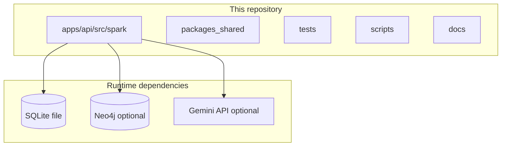
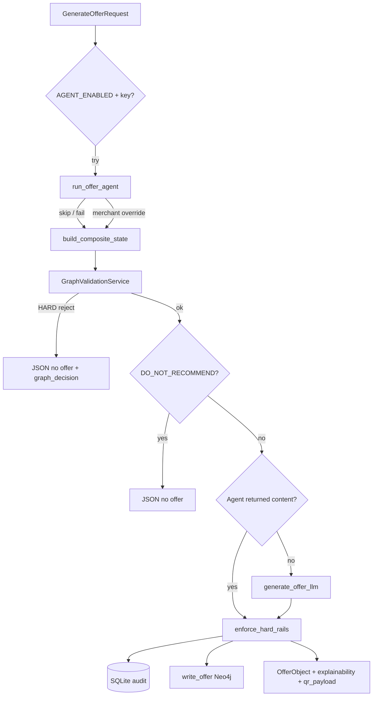

# Architecture — Spark

This document covers the high-level system design, backend routers, the hybrid offer pipeline, and data stores. 
For how to build, run, and test the code, see **[`DEVELOPMENT.md`](DEVELOPMENT.md)**. 
For deep graph database logic, see **[`NEO4J-GRAPH.md`](NEO4J-GRAPH.md)**.

---

## Layout (mental map)

```text
Generative-City-Wallet/
├── apps/
│   ├── api/src/spark/    # FastAPI app, services, SQLite, Neo4j graph layer
│   ├── mobile/           # Expo consumer app (@spark/mobile)
│   └── web-dashboard/    # Vite + React merchant UI scaffold (@spark/web-dashboard)
├── packages/shared/      # @spark/shared — TS contracts (mirror spark.models.contracts)
├── tests/                # pytest: smoke, graph rules, repository fallbacks, integration
├── scripts/              # benchmark_offer_latency, run_graph_maintenance
├── docs/                 # Current implementation docs
├── docs/planning/        # Design specs and historical product decisions
└── data/                 # spark.db (SQLite), optional neo4j/ volume mount
```



---

## Backend application

**Entry:** `apps/api/src/spark/main.py` — FastAPI app, CORS, router mounts, lifespan:

1. SQLite: create DB from `schema.sql` on first run or `init_database()`.
2. Neo4j: `init_graph()` → schema + migrations; if connected → merchant sync from SQLite, optional cleanup + preference decay.
3. Shutdown: `close_graph()`.

**Routers** (`apps/api/src/spark/routers/`):

| Prefix / routes | Responsibility |
|-----------------|----------------|
| `/api/payone/*` | Simulated merchant list + per-merchant density signal |
| `/api/context/*` | `POST /composite` — build `CompositeContextState` (weather, density, conflict, **graph preferences**) |
| `/api/offers/*` | **`POST /generate`** — hybrid agent + deterministic pipeline (below) |
| `/api/redemption/*`, `/api/wallet/*`, `/api/conflict/*`, `/api/offers/{id}/outcome` | QR validate/confirm, wallet, conflict helper, **non-redemption outcomes** for the graph |
| `/api/graph/*` | Health, stats, session debug, cleanup, decay, migrations |

**Core services** (`apps/api/src/spark/services/`):

| Module | Role |
|--------|------|
| `composite.py` | Assembles context; reads Neo4j preferences (fail-soft defaults) |
| `density.py` | Payone-style signal from SQLite transaction buckets |
| `conflict.py` | Stakeholder / occupancy framing rules |
| `offer_generator.py` | Gemini Flash structured JSON (or smart fallback) |
| `hard_rails.py` | Post-LLM enforcement — discount/expiry/name caps |
| `redemption.py` | HMAC QR, wallet credit, **graph projection** for redeem / decline / expire |
| `graph_rules.py` | Pre-LLM deterministic gate (budget, fatigue, cooldown, diversity, fairness) |
| `weather.py` | Stuttgart weather (OpenWeather optional) |

**Agents** (`apps/api/src/spark/agents/`): optional **Strands** “OfferAgent” (`run_offer_agent`) with tools (`tools.py`) for merchant survey, preferences, weather, conflict. Controlled by **`AGENT_ENABLED`** in `apps/api/src/spark/config.py` (`auto` when `GOOGLE_AI_API_KEY` is set). On success it can pick a merchant and sometimes supply content; **graph rules and hard rails still apply**.

---

## Hybrid offer pipeline (`POST /api/offers/generate`)

High level: **agent try → composite state → graph validation → conflict gate → content (agent or Gemini) → hard rails → SQLite → Neo4j write**.



**ASCII — two content sources, one rail:**

```text
  Agent (Strands)          Gemini Flash / fallback
        \                         /
         \____ both funnel ______/
                    |
                    v
           enforce_hard_rails (always)
                    |
                    v
              SQLite + optional Neo4j
```

---

## Data stores

### SQLite (`data/spark.db` by default)

Defined in **`apps/api/src/spark/db/schema.sql`**. Populated by **`apps/api/src/spark/db/seed.py`** (~28 days of hourly synthetic `payone_transactions` for five demo merchants + coupons + audit tables).

Notable tables:

- `merchants`, `payone_transactions`, `merchant_coupons`, `milestone_progress`
- `offer_audit_log` — offer lifecycle audit; QR validation reads from here
- `wallet_transactions` — cashback credits

### Neo4j (optional)

See **[`NEO4J-GRAPH.md`](NEO4J-GRAPH.md)**. Merchants are **mirrored** from SQLite on successful connect.
