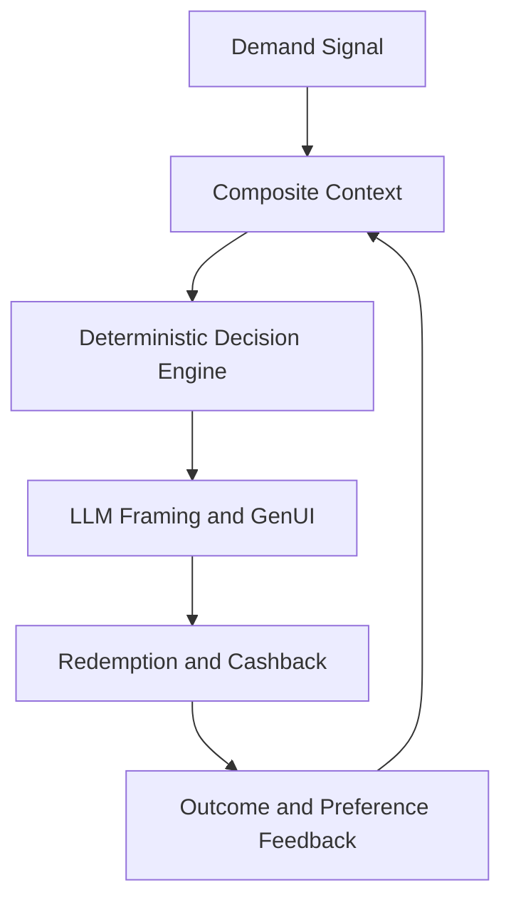

# Spark — Product Concept (Stable)

This document defines the long-lived product concept and governing principles.
Implementation specifics live in runtime architecture docs.

---

## Product thesis

Local merchants lose revenue during demand troughs because they cannot act in time.  
Spark turns payment-density weak signals into real-time, context-matched interventions:

1. detect demand gap,
2. match to nearby user intent,
3. deliver one relevant offer,
4. close loop through redemption and learning.

Spark is not a static loyalty catalog and not a coupon feed.

---

## Problem framing

### Merchant problem

- demand volatility at hour-of-week granularity
- poor reaction speed to intra-day troughs
- limited operator time for campaign optimization

### User problem

- generic, low-relevance notifications
- decision fatigue from offer feeds
- low trust in opaque targeting systems

### Platform problem

- disconnected payment telemetry and consumer interaction layers
- weak explainability in recommendation systems
- privacy and compliance risk from over-collection

---

## Core principles

1. **One offer at a time**  
   Relevance and clarity beat quantity.

2. **Deterministic decision, generative expression**  
   Rules decide eligibility/selection; LLM handles framing and visual tone.

3. **Privacy-first abstraction**  
   Use intent/context abstractions, not raw personal telemetry.

4. **Merchant-user incentive alignment**  
   Interventions should solve real supply-demand gaps, not indiscriminate discounting.

5. **Operational explainability**  
   Every recommendation path should be auditable and traceable.

---

## System concept loop

---

## Product surfaces

- **Consumer side:** card/push/lock/widget interaction surfaces
- **Merchant side:** pulse, rules, validation, analytics
- **Backend side:** deterministic gating + hard rails + lifecycle persistence

The user experience is driven by one core contract: a single explainable offer object with bounded lifecycle.

---

## Trust and compliance posture

- deterministic pre-LLM guardrails
- server-side hard-rail enforcement of business constraints
- lifecycle audit trail persistence
- fail-soft behavior when optional graph infrastructure is unavailable

---

## Strategic value

- **Merchants:** recover quiet-hour revenue and reduce manual campaign overhead
- **Users:** high-relevance local interventions with reduced spam
- **Platform:** measurable, auditable local-commerce activation loop

---

## Non-goals (current scope)

- social graph-based virality mechanics as core dependency
- unconstrained autonomous offer generation by LLM
- feed-style multi-offer browsing experiences

---

## Relationship to implementation docs

Use these for runtime truth:

- `ARCHITECTURE.md`
- `architecture/offer-decision-engine.md`
- `architecture/llm-and-hard-rails.md`
- `architecture/neo4j-graph.md`
- `DATA-MODEL.md`

Planning context and strategic narrative remain in:

- `docs/planning/BACKGROUND.md`
- `docs/planning/18-DSV-GAP-ANALYSIS.md`
