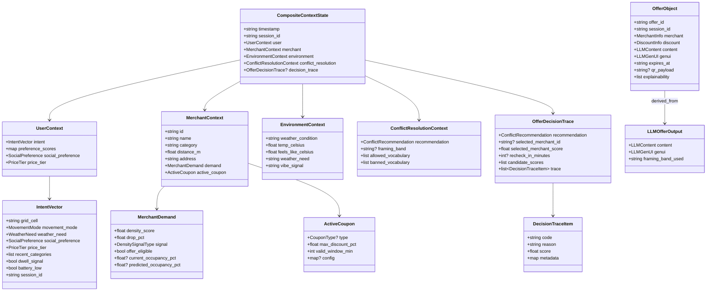
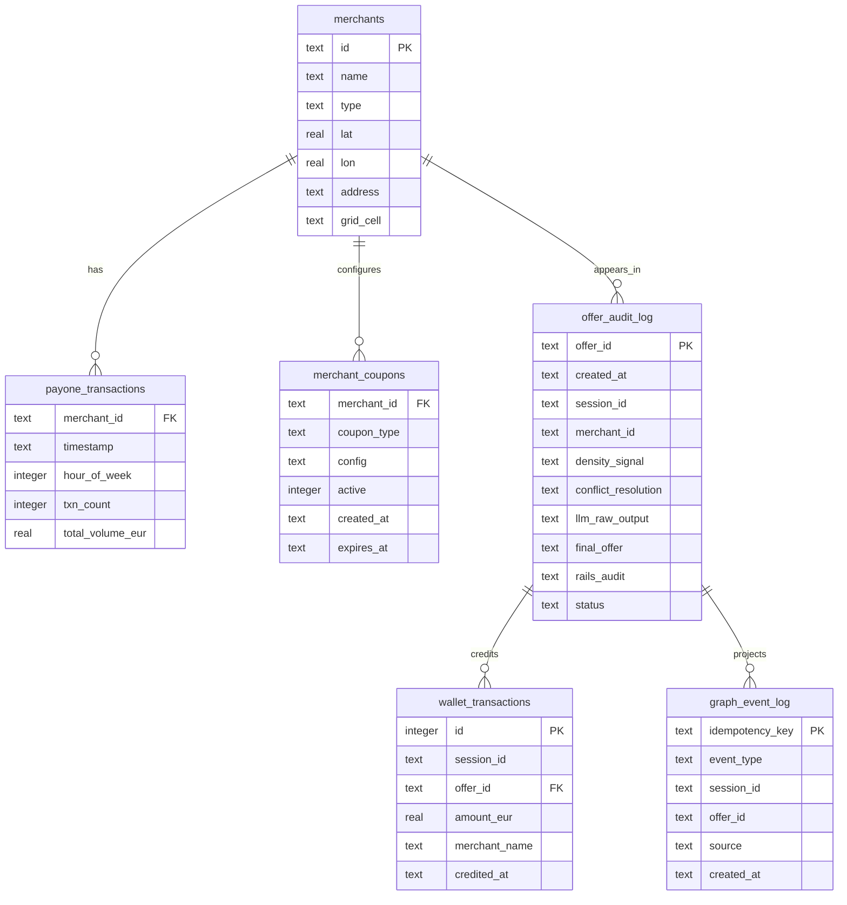
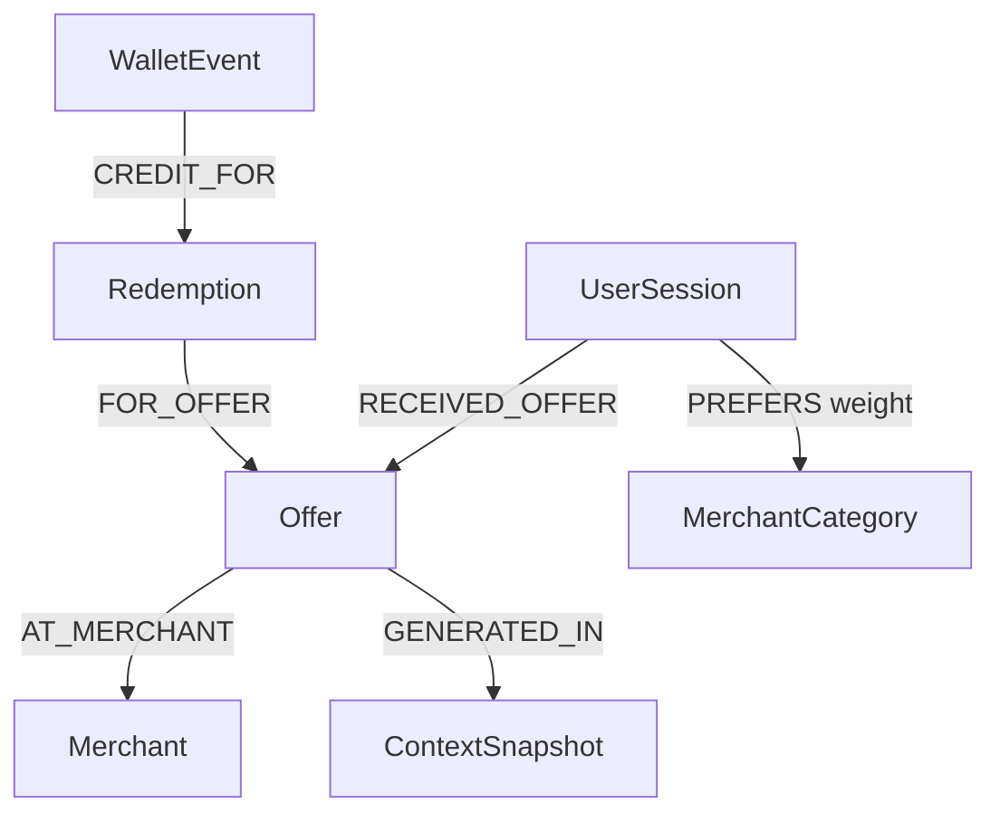
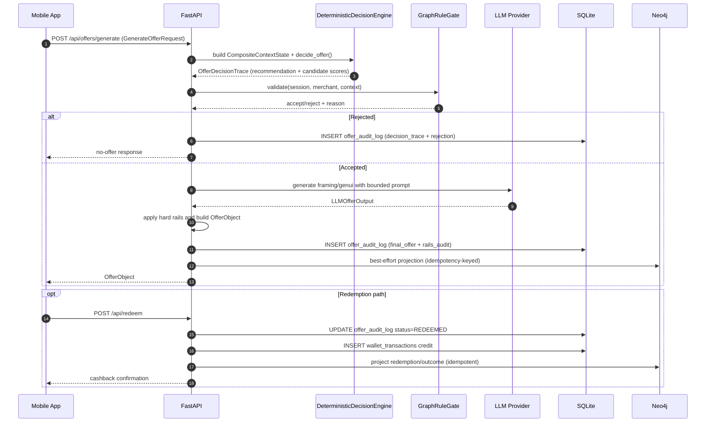

# Data Model

Canonical data model across contracts, SQLite persistence, and graph projection.

---

## Model layers

1. **Canonical API contracts (Python runtime)**  
   `apps/api/src/spark/models/contracts.py`
2. **Shared cross-client mirror (TypeScript)**  
   `packages/shared/src/contracts.ts` (`@spark/shared`)
3. **Operational store (SQLite)**  
   `apps/api/src/spark/db/schema.sql`
4. **Knowledge graph (Neo4j)**  
   projected best-effort from offer/outcome lifecycle

---

## Local vs cloud boundary (data classes)

### Local-only classes (conceptual/mobile side)

- raw sensor/event streams used to derive intent
- fine-grained location history before quantization
- private interaction logs used for local preference shaping

Only derived abstractions are eligible to cross the boundary.

### Boundary contract (cloud-ingested)

Primary ingress contract:

- `GenerateOfferRequest`
  - `intent: IntentVector`
  - optional `merchant_id`
  - optional `demo_overrides` (dev/demo only)

`IntentVector` is the core privacy boundary object and contains abstracted fields
such as `grid_cell`, `movement_mode`, and `weather_need` rather than raw telemetry.

### Cloud-resident classes/stores

- `CompositeContextState`, `OfferDecisionTrace`, `OfferObject`
- SQLite tables (`offer_audit_log`, `wallet_transactions`, `graph_event_log`, etc.)
- optional Neo4j projection entities for personalization and explainability

### Explicitly disallowed in cloud payloads

- raw latitude/longitude traces from device sensors
- raw transaction/event history used for local-only preference derivation
- unconstrained generative fields as source of truth for discount/expiry/merchant id

---

## Core class model (contracts)

---

## Persistence model (SQLite)

---

## Graph projection model (conceptual)

Projection is best-effort and idempotency-protected by SQLite `graph_event_log`.

---

## Offer lifecycle sequence (request to projection)

---

## Data ownership and authority

- **Source of truth for offer lifecycle:** SQLite `offer_audit_log`
- **Source of truth for wallet balance:** SQLite `wallet_transactions`
- **Source of truth for contract shape:** Python contracts in `apps/api/src/spark/models/contracts.py`
- **Parity requirement for frontend/shared consumers:** TypeScript mirror in `packages/shared/src/contracts.ts` must stay field-for-field aligned with Python
- **Graph:** derived/augmenting personalization layer, fail-soft

---

## Debug cookbook

1. Wrong response shape:
   - verify `contracts.py` model and serializer path in router.
2. Offer status mismatch:
   - inspect `offer_audit_log.status` and timestamps.
3. Duplicate graph side-effects:
   - inspect `graph_event_log` idempotency keys.
4. Unexpected density class:
   - inspect `payone_transactions` for merchant/hour-of-week baseline.
