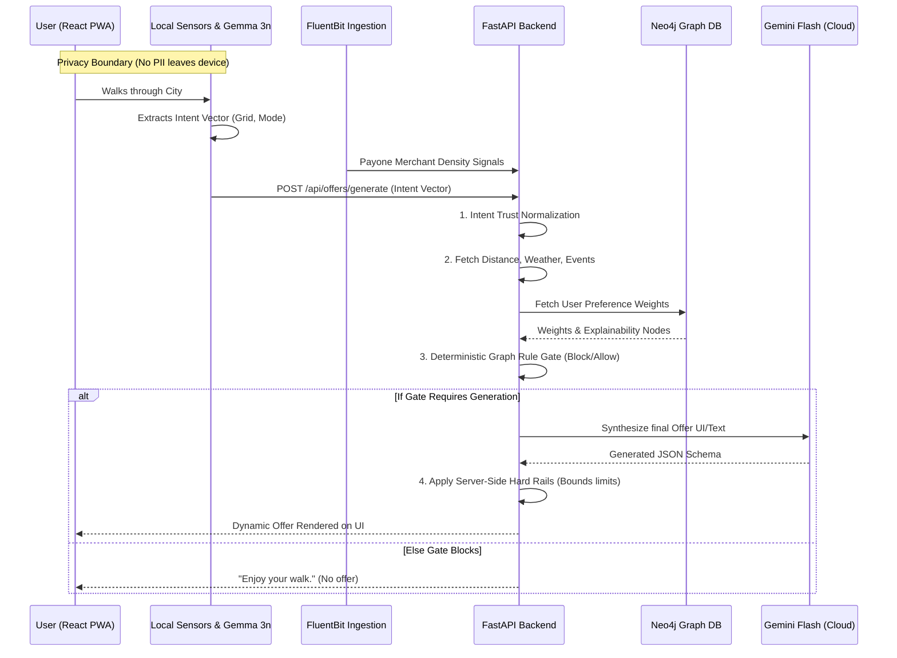

# 🏆 Spark — Hackathon Judge Guide

Welcome to the Spark codebase! This guide is designed specifically for Hackathon Judges to quickly understand the technical depth, architecture, and "Aha!" moments of our Generative City Wallet.

If you only have 5 minutes to evaluate the technical prowess of this project, focus here.

---

## The "Aha!" Technical Moments

Our team focused profoundly on **real-world viability**, moving far beyond a standard LLM wrapper. Here is where the heavy lifting happens:

### 1. Hybrid AI: Privacy-First Extractor + Cloud Generator
We do not send the user's raw GPS traces or accelerometer data to a cloud LLM. 
- **The On-Device Magic:** We utilize **Gemma 3n via Google AI Edge** directly on the phone to extract abstract "Intent Vectors". E.g., it looks at movement (`walking`), location (`quantized 50m grid cell`), and returns `weather_need: warmth_seeking`.
- **The Cloud Magic:** The highly efficient **Gemini Flash** receives only this anonymous intent vector. It then synthesizes the styling, text, and structure of the offer just in time.
- 🔍 **Where to look:** Real-time intent trust policies are enforced in `apps/api/src/spark/services/intent_trust.py`.

### 2. The Deterministic Guardrails
Large Language Models hallucinate. Generative discounting cannot be trusted to a naked LLM, as it risks merchant budget exhaustion.
- Before reaching Gemini, we use a **Deterministic Decision Engine** in Python. If the user is currently `commuting` (based on IMU speed), the system imposes a *hard block*—no offer is shown, respecting the user's focus. 
- 🔍 **Where to look:** Check `apps/api/src/spark/services/offer_decision.py` for the explicit thresholding and guarding rules.

### 3. The Neo4j Knowledge Graph Loop
We implemented a genuine reinforcement learning feedback loop using **Neo4j**, enabling explainability and adaptive personalization.
- **Why Neo4j?** It tracks pseudonymous session preferences as *nodes* and *edges*. If a user redeems a coffee offer, the `PREFERS` edge between the user and the "Coffee" node is reinforced. 
- **Graph Decay:** Preferences aren't static. A cron job linearly decays preference weights if not continually reinforced.
- 🔍 **Where to look:** The graph projection code lives in `apps/api/src/spark/graph/`.

---

## Architecture End-to-End Diagram

Here is exactly how data flows securely from the User's device to the generated Offer.

---

## Judging the Codebase: A Quick Directory Map

For the judges who dive straight into the code, here is your compass through the monorepo:

| Path | Purpose |
|------|---------|
| `apps/api/src/spark/services/` | **The Brains.** Business logic. Look here for bounding rules, trust levels, and context composite builders. |
| `apps/api/src/spark/graph/` | **The Memory.** Neo4j interactions. Look for idempotency logic, decay rules, and migration scripts. |
| `infra/fluentbit/` | **The Ears.** Log ingestion configurations modeling the Payone merchant data feed. |
| `apps/mobile/` | **The Face.** React PWA code, ensuring beautiful UI renders based on GenUI JSON schemas. |

*Thank you for reviewing Spark! We believe we have demonstrated that hyper-personalized AI can act deterministically, profitably, and with absolute respect for user privacy.*
