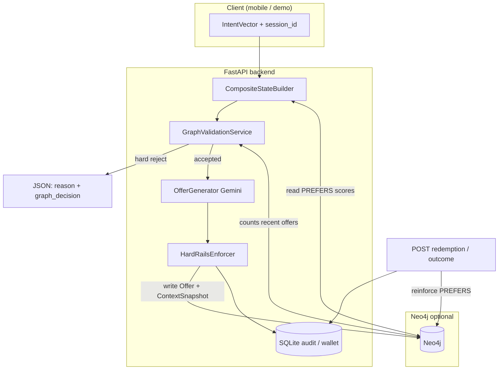
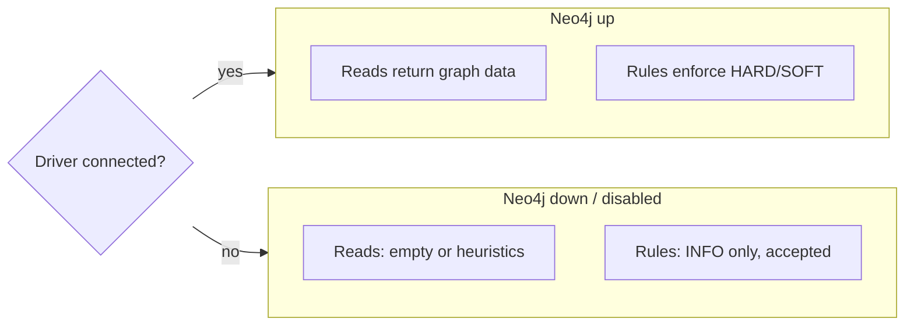
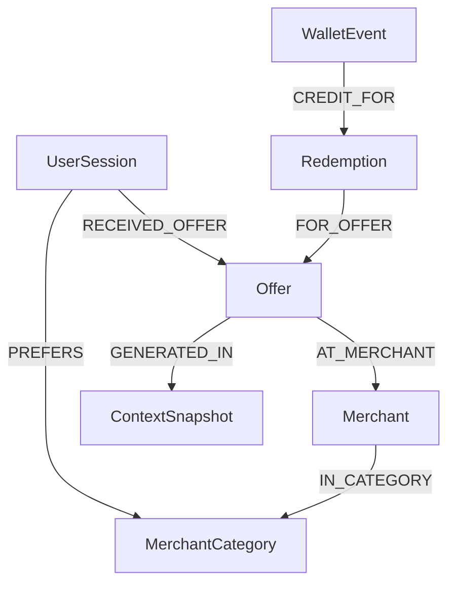
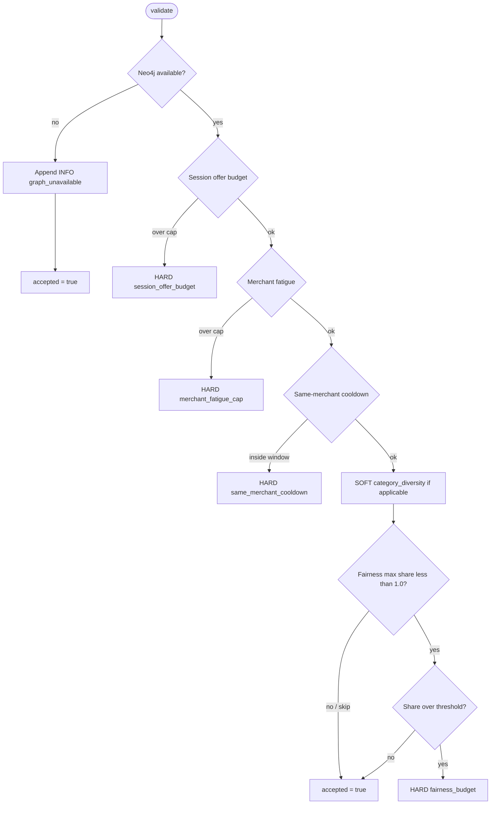
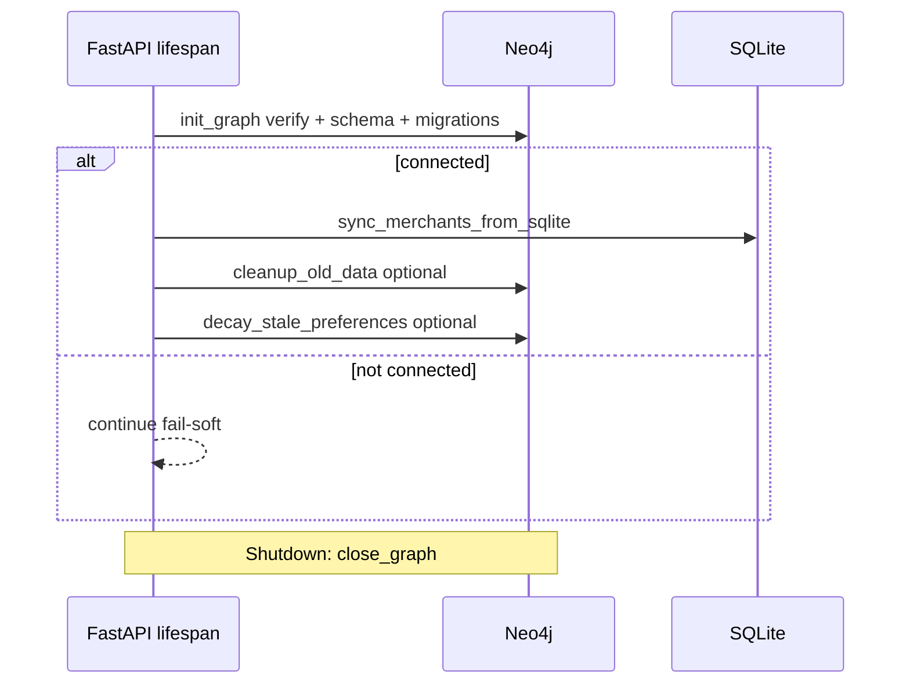

# Server-side user knowledge graph (Neo4j)

This document describes **what the FastAPI backend does today** with Neo4j: personalization signals, guardrails, lifecycle writes, explainability, and housekeeping. It is the authoritative reference for **runtime behavior**; product vision and older “on-device KG” notes live under [`planning/`](planning/README.md). For **everything else in the repo** (routers, SQLite, Strands agent hybrid, CI, Docker), see **[`REPOSITORY-OVERVIEW.md`](REPOSITORY-OVERVIEW.md)**.

---

## Architecture overview

End-to-end: **read preferences → rule gate → LLM → hard rails → SQLite audit → graph write**; redemption and outcomes **write back** to the graph.



**ASCII — single request spine (`POST /api/offers/generate`):**

```
  Intent + merchant
        |
        v
  build_composite_state ----read----> Neo4j (preferences) [fail-soft: defaults]
        |
        v
  GraphValidationService --query--> Neo4j (rules) [fail-soft: skip HARD block]
        |
   +----+----+
   |         |
   v         v
 block     proceed
   |         |
   v         v
 return    LLM -> rails -> SQLite -> Neo4j write (best-effort)
```

---

## Purpose

- **Personalization:** category preference weights from interactions feed the composite state used for offer generation.
- **Guardrails:** deterministic rules run **before** the LLM to limit spam, merchant fatigue, cooldowns, category diversity (soft), and optional fairness by category share.
- **Feedback loop:** offers sent, outcomes (accepted / declined / expired), redemptions, and wallet credits are projected into the graph when Neo4j is available.
- **Explainability:** successful offer responses include a small, API-stable `explainability` list (see shared contracts).
- **Operations:** metrics in `/api/health`, admin endpoints under `/api/graph/*`, retention, preference decay, and versioned migrations.

**Privacy stance:** the graph is keyed by **pseudonymous `session_id`** from the intent vector — not a named user account. Retention and cleanup reduce how long artifacts live in Neo4j.

---

## Fail-soft behavior

If Neo4j is disabled or unreachable at startup:

- The API **still runs**; SQLite remains the primary audit/store for offers and wallet.
- Graph reads return **empty or defaults** (e.g. heuristic preference scores).
- Graph rules emit an **INFO** “graph unavailable” note and **do not block** offers.

This is intentional so demos and production degrade gracefully.



---

## Graph model (v1)

**Nodes (conceptual)**

| Label | Role |
|-------|------|
| `UserSession` | `session_id` — anchor for preferences and offers |
| `Merchant` | Mirrored from SQLite seed |
| `MerchantCategory` | Category node linked from merchants |
| `Offer` | One node per `offer_id` |
| `ContextSnapshot` | Context at generation time (keyed by `offer_id` for idempotency) |
| `Redemption` | Post-confirm redemption |
| `WalletEvent` | Cashback credit linked to redemption |
| `GraphMigration` | Applied migration records |
| `GraphMeta` | e.g. `schema_version` |

**Relationships (high level)**

- `(UserSession)-[:RECEIVED_OFFER]->(Offer)` — delivery (idempotent on `offer_id`)
- `(Offer)-[:AT_MERCHANT]->(Merchant)`, `(Offer)-[:GENERATED_IN]->(ContextSnapshot)`
- `(UserSession)-[:PREFERS]->(MerchantCategory)` — weighted preference; optional `AVOIDS` in cleanup queries
- Outcomes / redemption: `HAD_OUTCOME`, `FOR_OFFER`, `CREDIT_FOR` as implemented in Cypher under `apps/api/src/spark/graph/queries.py`

Exact Cypher is centralized there; avoid duplicating it in product docs.

**Topology (core paths):**



**ASCII — preference reinforcement (simplified):**

```
  redemption / decline / expire
              |
              v
     reinforce_category(session, category, delta)
              |
              v
  (UserSession)-[PREFERS {weight, last_reinforced_unix, decay_rate}]->(MerchantCategory)
```

---

## Capabilities (checklist)

| Area | Capability |
|------|------------|
| **Read path** | Top category `PREFERS` weights loaded into `CompositeContextState.user.preference_scores` (fallback heuristics if empty / unavailable). |
| **Rule gate** | `GraphValidationService` before LLM: session daily budget, merchant fatigue, same-merchant cooldown, soft category diversity, optional fairness cap (`GRAPH_FAIRNESS_*`). |
| **Write path** | On generate: merge `Offer` + `ContextSnapshot` + `RECEIVED_OFFER`. On redemption / outcome: redemption, wallet, outcome edges + category reinforcement deltas. |
| **Idempotency** | Offer and snapshot keyed by `offer_id`; `MERGE` + relationship merge avoids duplicate subgraphs on retries. |
| **Explainability** | `OfferObject.explainability`: up to 3 structured reasons (e.g. top preferences, soft rule hint, rules passed). |
| **Decay** | Stale `PREFERS` edges can be linearly decayed by age (config + endpoint + optional startup + `scripts/ops/run_graph_maintenance.py`). |
| **Retention** | Deletes old offers (and related nodes), stale sessions without offers, and old `PREFERS`/`AVOIDS` edges past preference-edge retention. |
| **Migrations** | `GraphMigration` nodes; applied after schema bootstrap on connect; list via `GET /api/graph/migrations`. |
| **Observability** | `/api/graph/health`, `/api/graph/stats`, per-session preferences and recent offers; `/api/health` includes graph metrics. |

### Rule gate (order matters)

Rules run **only when the graph is available**; otherwise the gate accepts with an INFO note. When available, **hard** violations short-circuit (no LLM call).



---

## HTTP API (graph)

Base path: **`/api/graph`**

| Method | Path | Purpose |
|--------|------|---------|
| GET | `/health` | Neo4j availability + query metrics |
| GET | `/stats` | Aggregate node/relationship counts |
| GET | `/migrations` | Applied migration ids |
| GET | `/sessions/{session_id}/preferences` | Top `PREFERS` scores |
| GET | `/sessions/{session_id}/recent-offers` | Recent offers for debugging rules |
| POST | `/cleanup?retention_days=` | Housekeeping (offers + contexts + redemptions + wallet + stale sessions + old preference edges) |
| POST | `/decay-preferences?stale_after_days=&default_decay_rate=` | Decay stale preference weights |

Offer generation and redemption also touch the graph from **`/api/offers/*`** and **`/api/redemption/*`** (see code map below).

---

## Environment variables

Defined in **`apps/api/src/spark/config.py`** (load via project-root `.env`).

**Neo4j connection**

| Variable | Meaning |
|----------|---------|
| `NEO4J_URI` | Bolt URI (default `bolt://localhost:7687`) |
| `NEO4J_USER` | Username |
| `NEO4J_PASSWORD` | Password |
| `NEO4J_DATABASE` | Database name |
| `NEO4J_ENABLED` | `true` / `false` — disable to force fallback |
| `NEO4J_STARTUP_TIMEOUT_S` | Startup connectivity timeout |

**Rule thresholds** (`GRAPH_MERCHANT_FATIGUE_MAX`, `GRAPH_SAME_MERCHANT_COOLDOWN_MIN`, `GRAPH_CATEGORY_DIVERSITY_WINDOW`, `GRAPH_SESSION_OFFER_BUDGET`, `GRAPH_FAIRNESS_MAX_CATEGORY_SHARE`, `GRAPH_FAIRNESS_WINDOW`, `GRAPH_FAIRNESS_MIN_OBSERVATIONS`)

**Retention & decay**

| Variable | Meaning |
|----------|---------|
| `GRAPH_RETENTION_DAYS` | Age cutoff for offer-related cleanup |
| `GRAPH_RUN_CLEANUP_ON_STARTUP` | Run cleanup (and decay if enabled) after connect |
| `GRAPH_PREF_EDGE_RETENTION_DAYS` | Delete `PREFERS`/`AVOIDS` older than this |
| `GRAPH_PREF_DECAY_ENABLED` | Run decay on startup after cleanup |
| `GRAPH_PREF_DECAY_STALE_AFTER_DAYS` | Only decay edges not reinforced since N days |
| `GRAPH_PREF_DECAY_DEFAULT_RATE` | Per-day linear decay amount (edge property default) |

---

## Code map

| Path | Role |
|------|------|
| `apps/api/src/spark/graph/client.py` | Driver lifecycle, `safe_execute`, metrics |
| `apps/api/src/spark/graph/schema.py` | Constraints / indexes |
| `apps/api/src/spark/graph/migrations.py` | Versioned data migrations |
| `apps/api/src/spark/graph/queries.py` | All Cypher strings |
| `apps/api/src/spark/graph/repository.py` | `GraphRepository` — reads/writes/cleanup/decay |
| `apps/api/src/spark/graph/seed.py` | Merchant sync from SQLite |
| `apps/api/src/spark/services/graph_rules.py` | Rule gate |
| `apps/api/src/spark/services/composite.py` | Preference read path |
| `apps/api/src/spark/routers/offers.py` | Rules + LLM + `explainability` + graph write |
| `apps/api/src/spark/routers/redemption.py` | Redemption + outcome projection |
| `apps/api/src/spark/routers/graph.py` | Admin graph routes |
| `apps/api/src/spark/main.py` | Lifespan: init graph, seed merchants, cleanup/decay |
| `scripts/ops/run_graph_maintenance.py` | Cron-friendly cleanup + decay |
| `scripts/ops/benchmark_offer_latency.py` | p95 compare Neo4j on vs off |

**Contracts:** `apps/api/src/spark/models/contracts.py` and `packages/shared/src/contracts.ts` (`explainability` on `OfferObject`).

---

## Operational notes

- **Persistence:** Docker Neo4j typically mounts host `data/neo4j` (see root `README` Graph Ops section).
- **Benchmarks:** use `scripts/ops/benchmark_offer_latency.py` to compare latency with `NEO4J_ENABLED` true vs false.
- **Cron:** prefer `scripts/ops/run_graph_maintenance.py` over ad-hoc `curl` if you want one job for cleanup + decay.

**App startup vs scheduled job:**



**ASCII — maintenance script (`run_graph_maintenance.py`):**

```
  uv run python scripts/ops/run_graph_maintenance.py
        |
        +-- cleanup_old_data(retention_days)
        |         +-- offers + snapshots + redemptions + wallet events
        |         +-- stale UserSession (no offers)
        |         +-- old PREFERS / AVOIDS edges
        |
        +-- decay_stale_preferences(stale_after_days, decay_rate)
                  +-- linear weight pull toward 0 for stale PREFERS
```

---


## Not in scope (yet)

- Cross-session identity resolution or PII in the graph.
- Full “reason path” export on every rejection path (some rejections return structured `graph_decision` without a full offer payload).
- Automated legal retention policies beyond configurable days (ops-owned).

---

## See also

- **[`ARCHITECTURE.md`](ARCHITECTURE.md)** — full backend layout, hybrid offer agent path, and how this graph fits the rest of the repo.
- **[`DEVELOPMENT.md`](DEVELOPMENT.md)** — repo structure, CI, Docker, and npm/uv commands.
- **[`planning/13-ON-DEVICE-AI-AND-KNOWLEDGE-GRAPH.md`](planning/13-ON-DEVICE-AI-AND-KNOWLEDGE-GRAPH.md)** — original KG + on-device framing (complements this server graph).
- **[`../README.md`](../README.md#graph-ops-neo4j)** — quick `curl` and cron examples.
