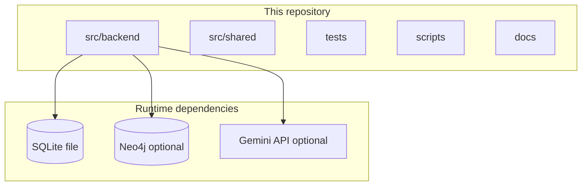
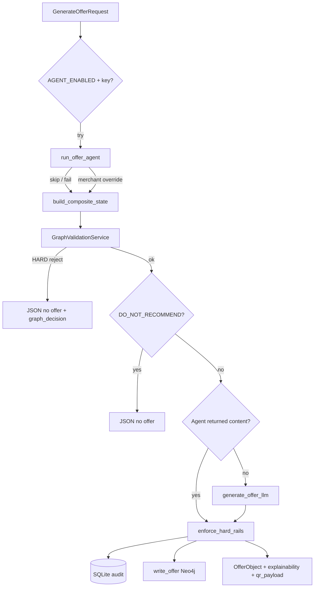

# Repository overview — what lives here today

This repo is a **hackathon-scale Spark backend**: FastAPI + SQLite (source of truth for merchants, synthetic Payone transactions, offer audit, wallet) plus an **optional Neo4j** user/session knowledge graph. There is **no mobile or Next.js app** in this tree; contracts in `src/shared/` exist for consumers elsewhere.

For **Neo4j-only** depth (model, rules, ops, diagrams), see **[`USER-KNOWLEDGE-GRAPH-NEO4J.md`](USER-KNOWLEDGE-GRAPH-NEO4J.md)**. For product and pitch material, see **[`planning/README.md`](planning/README.md)**.

---

## Layout (mental map)

```
Generative-City-Wallet/
├── src/backend/          # FastAPI app, services, SQLite, Neo4j graph layer
├── src/shared/           # TypeScript mirrors of Pydantic contracts (mobile/dashboard)
├── tests/                # pytest: smoke, graph rules, repository fallbacks, integration
├── scripts/              # benchmark_offer_latency, run_graph_maintenance
├── docs/                 # Current implementation docs (this file, Neo4j doc, README index)
├── docs/planning/        # Design specs, moved from legacy flat docs/
├── data/                 # spark.db (SQLite), optional neo4j/ volume mount
├── docker-compose.yml    # Backend + .env + ./data mount
├── Dockerfile            # Production-style image (uv sync, uvicorn)
└── .github/workflows/    # CI: ruff, pyright, pytest, pip-audit, Docker build
```



---

## Backend application

**Entry:** `src/backend/main.py` — FastAPI app, CORS, router mounts, lifespan:

1. SQLite: create DB from `schema.sql` on first run or `init_database()`.
2. Neo4j: `init_graph()` → schema + migrations; if connected → merchant sync from SQLite, optional cleanup + preference decay.
3. Shutdown: `close_graph()`.

**Routers** (`src/backend/routers/`):

| Prefix / routes | Responsibility |
|-----------------|----------------|
| `/api/payone/*` | Simulated merchant list + per-merchant density signal |
| `/api/context/*` | `POST /composite` — build `CompositeContextState` (weather, density, conflict, **graph preferences**) |
| `/api/offers/*` | **`POST /generate`** — hybrid agent + deterministic pipeline (below) |
| `/api/redemption/*`, `/api/wallet/*`, `/api/conflict/*`, `/api/offers/{id}/outcome` | QR validate/confirm, wallet, conflict helper, **non-redemption outcomes** for the graph |
| `/api/graph/*` | Health, stats, session debug, cleanup, decay, migrations |

**Core services** (`src/backend/services/`):

| Module | Role |
|--------|------|
| `composite.py` | Assembles context; reads Neo4j preferences (fail-soft defaults) |
| `density.py` | Payone-style signal from SQLite transaction buckets |
| `conflict.py` | Stakeholder / occupancy framing rules |
| `offer_generator.py` | Gemini Flash structured JSON (or smart fallback) |
| `hard_rails.py` | Post-LLM enforcement — discount/expiry/name caps |
| `redemption.py` | HMAC QR, wallet credit, **graph projection** for redeem / decline / expire |
| `graph_rules.py` | Pre-LLM deterministic gate (budget, fatigue, cooldown, diversity, fairness) |
| `weather.py` | Stuttgart weather (OpenWeather optional) |

**Agents** (`src/backend/agents/`): optional **Strands** “OfferAgent” (`run_offer_agent`) with tools (`tools.py`) for merchant survey, preferences, weather, conflict. Controlled by **`AGENT_ENABLED`** in `src/backend/config.py` (`auto` when `GOOGLE_AI_API_KEY` is set). On success it can pick a merchant and sometimes supply content; **graph rules and hard rails still apply**.

---

## Hybrid offer pipeline (`POST /api/offers/generate`)

High level: **agent try → composite state → graph validation → conflict gate → content (agent or Gemini) → hard rails → SQLite → Neo4j write**.



**ASCII — two content sources, one rail:**

```
  Agent (Strands)          Gemini Flash / fallback
        \                         /
         \____ both funnel ______/
                    |
                    v
           enforce_hard_rails (always)
                    |
                    v
              SQLite + optional Neo4j
```

---

## Data stores

### SQLite (`data/spark.db` by default)

Defined in **`src/backend/db/schema.sql`**. Populated by **`src/backend/db/seed.py`** (~28 days of hourly synthetic `payone_transactions` for five demo merchants + coupons + audit tables).

Notable tables:

- `merchants`, `payone_transactions`, `merchant_coupons`, `milestone_progress`
- `offer_audit_log` — offer lifecycle audit; QR validation reads from here
- `wallet_transactions` — cashback credits

### Neo4j (optional)

See **[`USER-KNOWLEDGE-GRAPH-NEO4J.md`](USER-KNOWLEDGE-GRAPH-NEO4J.md)**. Merchants are **mirrored** from SQLite on successful connect.

---

## Shared contracts

- **Python:** `src/backend/models/contracts.py` (Pydantic) — intent, composite state, offer object, redemption types, **`explainability`** on offers.
- **TypeScript:** `src/shared/contracts.ts` — keep in sync for Expo / Next.js consumers.

---

## Scripts

| Script | Purpose |
|--------|---------|
| `scripts/benchmark_offer_latency.py` | Spawns API twice (Neo4j on/off), measures p95 for `/api/offers/generate` |
| `scripts/run_graph_maintenance.py` | One-shot cleanup + preference decay (cron-friendly) |

---

## CI / quality (`.github/workflows/ci.yml`)

- **Lint:** `ruff check` + `ruff format --check` on `src/`
- **Types:** `pyright src/backend/`
- **Tests:** `pytest tests/` with `SPARK_DB_PATH=:memory:`
- **Smoke:** uvicorn boot + `GET /api/health`
- **Security:** `pip-audit`, SBOM + Grype (non-blocking), Docker build + Trivy scan

---

## Docker

- **`Dockerfile`:** Python 3.12 slim, `uv sync --frozen`, copies `src/`, runs uvicorn on `8000`.
- **`docker-compose.yml`:** single `backend` service, `.env`, mounts `./data` → `/app/data` (SQLite + optional Neo4j host data).

Neo4j is **not** defined in compose in-repo; run it separately or extend compose (see root **`README.md`** Graph Ops).

---

## Tests (`tests/`)

| File | Focus |
|------|--------|
| `test_smoke.py` | Health, merchants, density, offer generate, conflict |
| `test_graph_rules.py` | `GraphValidationService` with fake repository |
| `test_graph_repository_fallback.py` | Fail-soft when graph unavailable |
| `test_composite_graph_integration.py` | Composite + offer path with stubs |

---

## Other folders

| Path | Notes |
|------|--------|
| `resources/` | Markdown notes (e.g. Gemini chat, liability thread) — reference only |
| `AGENTS.md` | Cursor/agent workspace preferences and learned facts |

---

## Configuration reference

Authoritative defaults and env vars: **`src/backend/config.py`**. Highlights:

- `SPARK_DB_PATH`, `GOOGLE_AI_API_KEY`, `OPENWEATHER_API_KEY`, `GEMINI_MODEL`, `SPARK_HMAC_SECRET`
- `AGENT_ENABLED` (`auto` / `true` / `false`)
- `NEO4J_*`, `GRAPH_*` rule thresholds, retention, decay (Neo4j doc tables duplicate this for graph-only readers)

---

## See also

| Doc | Use when |
|-----|----------|
| [`USER-KNOWLEDGE-GRAPH-NEO4J.md`](USER-KNOWLEDGE-GRAPH-NEO4J.md) | Graph model, APIs, env, diagrams, ops |
| [`../README.md`](../README.md) | Product pitch + Graph Ops `curl` / cron |
| [`../src/README.md`](../src/README.md) | Short backend quick start (may be narrower than this file) |
| [`planning/README.md`](planning/README.md) | Design and planning archive |
