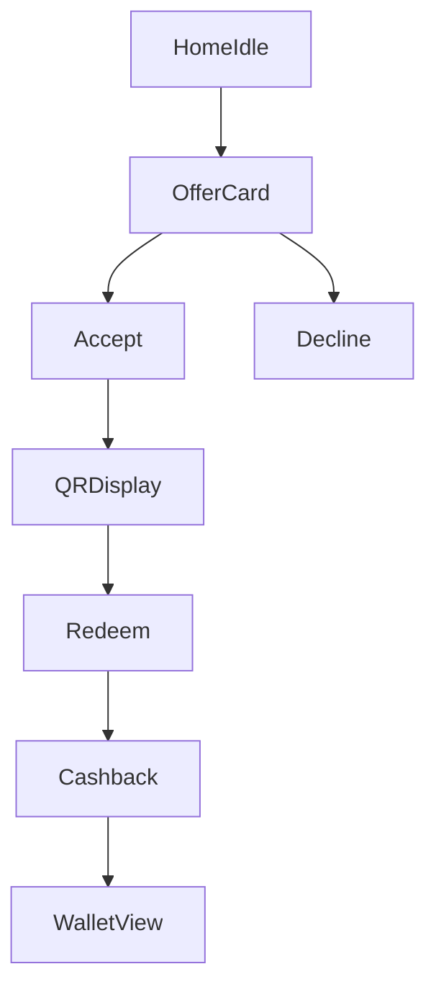

# Consumer App Surfaces

Consumer-facing delivery and interaction surfaces tied to backend offer lifecycle.

## Quick Navigation

- [Surfaces](#surfaces)
- [Primary user flow](#primary-user-flow)
- [Runtime constraints](#runtime-constraints)
- [Surface responsibilities](#surface-responsibilities)

---

## Surfaces

1. in-app offer card
2. rich push notification
3. lock-screen/live activity
4. widget

---

## Primary user flow

### Runtime code links

| Concern | File |
|---|---|
| Mobile app shell and flow wiring | [`apps/mobile/App.tsx`](../../apps/mobile/App.tsx) |
| Offer generation API route | [`apps/api/src/spark/routers/offers.py`](../../apps/api/src/spark/routers/offers.py) |
| Redemption confirm route | [`apps/api/src/spark/routers/redemption.py`](../../apps/api/src/spark/routers/redemption.py) |
| Mobile API integration docs | [`apps/mobile/README.md`](../../apps/mobile/README.md) |

---

## Runtime constraints

- one active unresolved offer per session
- anti-spam caps and cooldown windows enforced server-side
- movement hard blocks prevent unsafe/irrelevant interruptions
- QR validity and redemption state come from backend source of truth

---

## Surface responsibilities

- in-app card: richest context framing and CTA
- push: low-friction acceptance entry
- lock-screen/live activity: active-offer countdown continuity
- widget: passive visibility and wallet awareness
