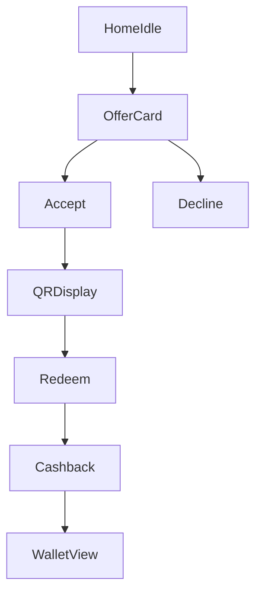

# Consumer App Surfaces

Consumer-facing delivery and interaction surfaces tied to backend offer lifecycle.

---

## Surfaces

1. in-app offer card
2. rich push notification
3. lock-screen/live activity
4. widget

---

## Primary user flow

---

## Runtime constraints

- one active unresolved offer per session
- anti-spam caps and cooldown windows enforced server-side
- movement hard blocks prevent unsafe/irrelevant interruptions
- QR validity and redemption state come from backend source of truth

---

## Surface responsibilities

- in-app card: richest context framing and CTA
- push: low-friction acceptance entry
- lock-screen/live activity: active-offer countdown continuity
- widget: passive visibility and wallet awareness
