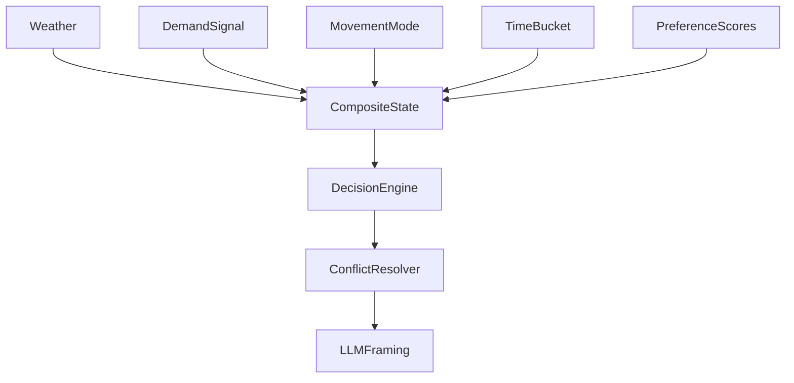

# Context Signals

Runtime signal model and composite context assembly.

---

## Signal categories

- environmental (weather condition and derived need)
- merchant demand (density/current-vs-baseline)
- movement/mobility (intent mode)
- temporal (hour/day bucketing)
- preference signals (graph-derived or fallback heuristics)

---

## Composite assembly role

`build_composite_state()` assembles signal inputs into `CompositeContextState`, then attaches:

- conflict resolution framing constraints
- deterministic decision trace



---

## Runtime invariants

- composite context is always available for offer endpoint path
- preference scores are always present (graph values or defaults)
- conflict framing vocabulary is attached before LLM call

---

## Known simplifications

- distance currently uses deterministic proxy in backend scoring path
- some advanced planning signals remain roadmap items (OCR transit, wallet seed, Spark Wave)

---

## Implementation

- models: `apps/api/src/spark/models/contracts.py`
- builder: `apps/api/src/spark/services/composite.py`
- decision: `apps/api/src/spark/services/offer_decision.py`

---

## Composite example (shape)

```json
{
  "session_id": "sess-123",
  "user": {
    "intent": {"movement_mode": "browsing", "weather_need": "warmth_seeking"},
    "preference_scores": {"cafe": 0.82, "bar": 0.4}
  },
  "merchant": {
    "id": "MERCHANT_001",
    "demand": {"signal": "PRIORITY", "drop_pct": 0.66}
  },
  "conflict_resolution": {"recommendation": "RECOMMEND_WITH_FRAMING"},
  "decision_trace": {"selected_merchant_id": "MERCHANT_001"}
}
```

---

## Debug cookbook

1. Unexpected merchant selection:
   - inspect `decision_trace` in composite state.
2. Missing preferences:
   - verify graph availability and fallback defaults.
3. Wrong weather-derived tone:
   - inspect `weather_need` and `vibe_signal` classification.
4. Offer blocked unexpectedly:
   - inspect movement mode and hard-block metadata.
