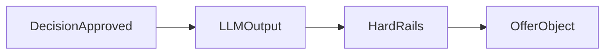

# LLM and Hard Rails

Safety and boundary model for generated offer content.

---

## Core boundary

- Deterministic engine decides eligibility and merchant selection.
- LLM generates wording/style only after deterministic approval.
- Hard rails enforce final business and safety constraints.
- Raw model output is never treated as the final offer contract.
- Python canonicalization owns DB-truth overrides, typed offer assembly, and rails audit.



---

## Hard rail checks

Implemented in `apps/api/src/spark/services/hard_rails.py`:

1. merchant name/address resolved from DB context
2. discount capped by active coupon config
3. expiry computed server-side
4. banned health/safety claims scrubbed
5. placeholders normalized
6. canonical mapping actions recorded for audit persistence

## Why hard rails stay in Python

- They depend on DB truth, not just event payload fields.
- They build the canonical `OfferObject`, not an ingress-side intermediate record.
- They need typed runtime models and stable audit metadata for later inspection.
- They sit on the boundary between generative output (`LLMOfferOutput`) and the final server contract (`OfferObject`).

---

## What LLM cannot decide

- offer eligibility
- merchant entitlement values
- hard financial terms outside configured limits
- lifecycle timestamps

---

## Failure and fallback

- If provider call fails, runtime falls back to deterministic smart fallback generation.
- Hard rails still run on fallback output.
- API should continue returning structurally valid offer objects when eligible.

---

## Audit and explainability hooks

- rails metadata persisted in offer audit log (`rails_audit` payload)
- canonical mapping actions record what was rewritten, defaulted, derived, or redacted
- decision trace and graph decision metadata also attached by router layer

---

## Code map

- `apps/api/src/spark/services/offer_generator.py`
- `apps/api/src/spark/services/hard_rails.py`
- `apps/api/src/spark/routers/offers.py`

---

## Example before and after rails

Input (LLM-side intent):

```json
{
  "content": {
    "headline": "Warm up at [MERCHANT_NAME]",
    "subtext": "Only [DISCOUNT]% right now"
  }
}
```

Output (post rails):

```json
{
  "merchant": {"name": "Cafe One"},
  "discount": {"value": 15, "source": "merchant_rules_db"},
  "content": {
    "headline": "Warm up at Cafe One",
    "subtext": "Only 15 % right now"
  },
  "expires_at": "2026-04-26T10:15:00"
}
```

---

## Debug cookbook

1. Wrong discount value:
   - inspect active coupon config in DB and post-rails output.
2. Placeholder leakage:
   - confirm `_replace_placeholders` path applied in `hard_rails.py`.
3. Unsafe wording:
   - verify banned pattern filter replaced phrase.
4. LLM outage:
   - confirm fallback generation path and still-valid `OfferObject`.
