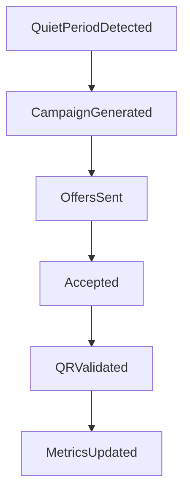

# Merchant Dashboard

Business-facing view for demand monitoring, campaign control, and redemption operations.

---

## Core sections

- overview (pulse + status)
- rules
- analytics
- validate (QR)
- profile/settings

---

## Operational loop

---

## Coupling to backend

- density signal source from transaction simulation/live path
- coupon/rule persistence in DB-backed merchant config
- QR validation and confirmation via redemption routes
- outcome lifecycle updates for analytics and preference feedback

---

## Runtime expectations

- minimal operator effort after initial rule setup
- clear status states (normal, quiet, active campaign, flash)
- fast validation loop for counter/staff workflows
