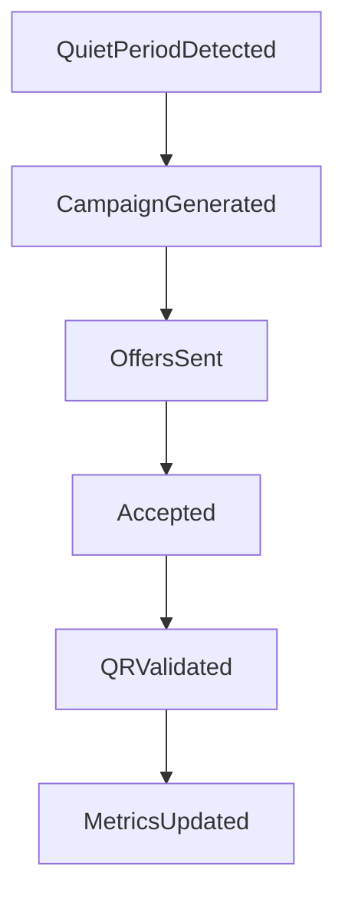

# Merchant Dashboard

Business-facing view for demand monitoring, campaign control, and redemption operations.

## Quick Navigation

- [Core sections](#core-sections)
- [Operational loop](#operational-loop)
- [Coupling to backend](#coupling-to-backend)
- [Runtime expectations](#runtime-expectations)

---

## Core sections

- overview (pulse + status)
- rules
- analytics
- validate (QR)
- profile/settings

---

## Operational loop

### Runtime code links

| Concern | File |
|---|---|
| Dashboard app package | [`apps/web-dashboard`](../../apps/web-dashboard) |
| Offer generation + analytics feed entrypoint | [`apps/api/src/spark/routers/offers.py`](../../apps/api/src/spark/routers/offers.py) |
| Redemption/QR validation path | [`apps/api/src/spark/routers/redemption.py`](../../apps/api/src/spark/routers/redemption.py) |
| Density signal service | [`apps/api/src/spark/services/density.py`](../../apps/api/src/spark/services/density.py) |
| Transaction ingest route | [`apps/api/src/spark/routers/payone.py`](../../apps/api/src/spark/routers/payone.py) |

---

## Coupling to backend

- density signal source from transaction simulation/live path
- coupon/rule persistence in DB-backed merchant config
- QR validation and confirmation via redemption routes
- outcome lifecycle updates for analytics and preference feedback

---

## Runtime expectations

- minimal operator effort after initial rule setup
- clear status states (normal, quiet, active campaign, flash)
- fast validation loop for counter/staff workflows
