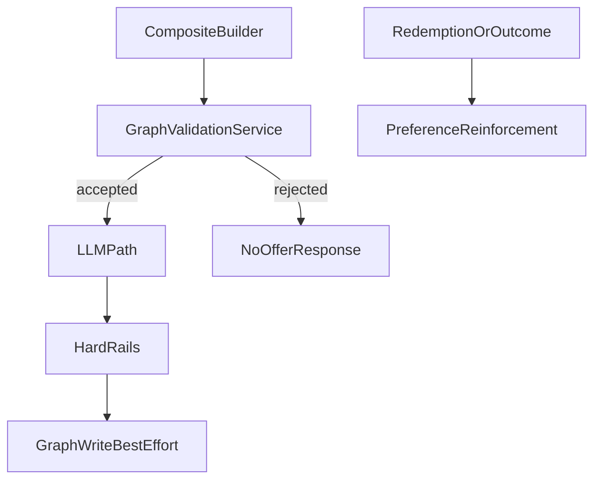

# Neo4j Graph

Server-side graph layer for personalization, deterministic gating, and feedback reinforcement.

---

## Runtime responsibilities

- read preference weights for composite context
- run deterministic pre-LLM gate via graph-backed counters/history
- write offer/outcome/redemption artifacts
- support cleanup and decay operations

---

## Request-time flow



---

## Fail-soft behavior

If graph is unavailable:

- preference reads fall back to heuristics/defaults
- graph rule gate emits INFO (`graph_unavailable`) and accepts
- graph writes are skipped best-effort, API continues via SQLite source of truth

---

## Rule gate order

`GraphValidationService` order:

1. session budget (HARD)
2. merchant fatigue (HARD)
3. same-merchant cooldown (HARD)
4. category diversity (SOFT)
5. fairness share cap (HARD, conditional)

Short-circuit on first HARD rejection.

---

## Idempotency and retention

- Offer and context writes are merge/idempotent on offer identity.
- Graph projection side effects are guarded via SQLite `graph_event_log` idempotency keys.
- Maintenance operations include retention cleanup and stale preference decay.

---

## Operational endpoints

- `/api/graph/health`
- `/api/graph/stats`
- `/api/graph/migrations`
- `/api/graph/cleanup`
- `/api/graph/decay-preferences`

---

## Code map

- `apps/api/src/spark/graph/*`
- `apps/api/src/spark/services/graph_rules.py`
- `apps/api/src/spark/routers/graph.py`
- `apps/api/src/spark/routers/offers.py`
- `apps/api/src/spark/routers/redemption.py`

---

## Test coverage

- `tests/unit/test_graph_rules.py` (gate behavior)
- `tests/unit/test_redemption_idempotency.py` (idempotency key behavior)

---

## Minimal schema snippets

Core conceptual entities:

```text
UserSession(session_id)
Merchant(merchant_id)
Offer(offer_id)
MerchantCategory(name)
```

Critical relationship families:

```text
(UserSession)-[:PREFERS]->(MerchantCategory)
(UserSession)-[:RECEIVED_OFFER]->(Offer)
(Offer)-[:AT_MERCHANT]->(Merchant)
```

---

## API examples

Graph gate rejection metadata is returned in offer path:

```json
{
  "offer": null,
  "rule_id": "same_merchant_cooldown",
  "graph_decision": {
    "accepted": false,
    "violations": [
      {"rule_id": "same_merchant_cooldown", "severity": "hard"}
    ]
  }
}
```

---

## Debug cookbook

1. Graph health:
   - call `/api/graph/health` and confirm availability.
2. Rule rejection reason:
   - inspect `graph_decision.violations[0]` in `/api/offers/generate` response.
3. Unexpected repeated writes:
   - inspect SQLite `graph_event_log` for idempotency key reuse.
4. Preference not affecting ranking:
   - inspect `/api/graph/sessions/{session_id}/preferences`.
