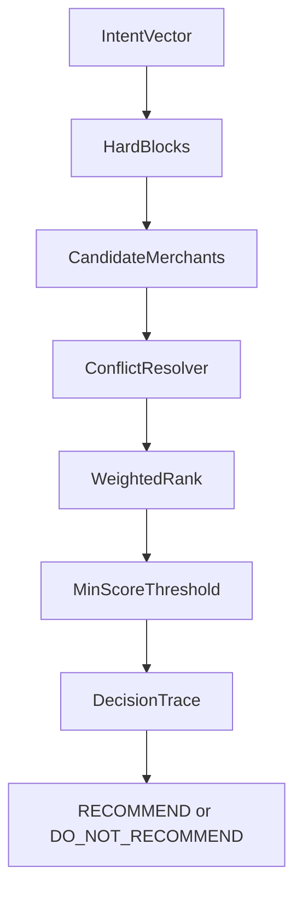

# Offer Decision Engine

Deterministic engine for choosing one merchant (or no offer) per request.

Implementation: `apps/api/src/spark/services/offer_decision.py`.

---

## Pipeline



---

## Invariants

- Exactly one unresolved offer per session at a time.
- `movement_mode=exercising` always blocks offer generation.
- `movement_mode=post_workout` applies deterministic recovery boosts and nightlife suppression.
- If no candidate reaches threshold, return `DO_NOT_RECOMMEND`.
- LLM does not change selection outcome.

---

## Hard blocks

Current hard-block checks:

1. movement hard block (`exercising`)
2. unresolved active offer (`SENT` or `ACCEPTED`)
3. session daily cap (3 in rolling 24h)

When blocked, result includes `recheck_in_minutes` and trace metadata.

Movement-aware retry behavior:

- `post_workout` shortens retry windows for negative decisions to keep recommendations aligned with short-lived recovery context.
- unresolved-offer guard recheck is movement-aware (`post_workout` rechecks sooner than default browsing flow).

---

## Scoring model

Current weighted components:

- density drop: `0..40`
- distance proxy: `0..25` (currently fixed proxy value in backend)
- preference match: `0..20`
- weather alignment: `0..10`
- movement-category adjustment:
  - `post_workout` recovery boost: `+18`
  - `post_workout` nightlife suppression: `-14`

Minimum threshold:

- `MIN_SCORE_THRESHOLD = 30.0`

Conflict resolver acts as a pre-filter: candidates with `DO_NOT_RECOMMEND` are excluded.

---

## Output contract

The engine returns:

- recommendation (`RECOMMEND`, `RECOMMEND_WITH_FRAMING`, `DO_NOT_RECOMMEND`)
- selected merchant id (nullable)
- selected score
- recheck minutes (nullable)
- candidate score summary
- stepwise decision trace

This is stored in `CompositeContextState.decision_trace`.

---

## Example trace (shape)

```json
{
  "recommendation": "RECOMMEND",
  "selected_merchant_id": "MERCHANT_001",
  "selected_merchant_score": 67.5,
  "candidate_scores": [
    {"merchant_id": "MERCHANT_001", "score": 67.5, "recommendation": "RECOMMEND"},
    {"merchant_id": "MERCHANT_002", "score": 51.0, "recommendation": "RECOMMEND_WITH_FRAMING"}
  ],
  "trace": [
    {"code": "density_drop", "score": 28.0},
    {"code": "distance_proxy", "score": 25.0},
    {"code": "preference_match", "score": 9.5},
    {"code": "weather_alignment", "score": 5.0},
    {
      "code": "movement_category_adjustment",
      "score": 18.0,
      "metadata": {"movement_mode": "post_workout", "merchant_category": "cafe"}
    }
  ]
}
```

---

## Failure behavior

- no candidates -> deterministic `DO_NOT_RECOMMEND`
- all candidates filtered by conflict -> deterministic `DO_NOT_RECOMMEND`
- below threshold -> deterministic `DO_NOT_RECOMMEND`

No exception path should be required for expected negative decisions.

---

## Test coverage

- `tests/unit/test_offer_decision.py`
  - exercising hard block
  - candidate ranking and selection
  - single-offer guard behavior
  - post-workout recovery preference boost
  - post-workout movement-aware recheck timing

---

## Endpoint interaction example

Decision output is consumed through `POST /api/offers/generate`.

Example no-offer response shape when blocked:

```json
{
  "offer": null,
  "reason": "Conflict resolution determined not to recommend at this time.",
  "recommendation": "DO_NOT_RECOMMEND",
  "recheck_in_minutes": 30,
  "decision_trace": {
    "recommendation": "DO_NOT_RECOMMEND",
    "selected_merchant_id": null,
    "selected_merchant_score": 22.0
  }
}
```

---

## Debug cookbook

1. Check unresolved offer guard:
   - verify session has rows in `offer_audit_log` with `status in ('SENT','ACCEPTED')`.
   - check movement-specific `recheck_in_minutes` in decision response.
2. Check candidate pool:
   - verify merchants in session `grid_cell`.
3. Check threshold misses:
   - inspect `decision_trace.candidate_scores`.
4. Check conflict filtering:
   - inspect `decision_trace.trace` entries and conflict reason.
5. Check movement rollout behavior:
   - inspect `decision_trace.trace` for `movement_category_adjustment` and associated metadata.
